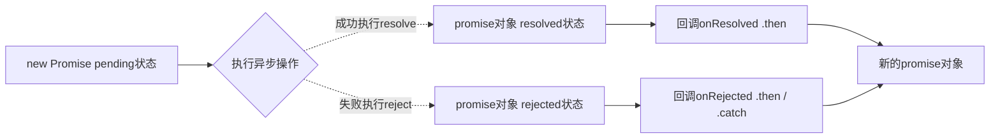

# JavaScript
## 基础操作
### 基本类型
* 三大输出语句
>alert();，alert输出来都是字符串，都会toString()
>document.write();
>console.log()

* 转义
>转为字符串：toString()
>转为整数：parseInt()
>转为浮点型：parseFloat()
>Boolean()函数：数字除了0和NaN,其余都是true，字符串除了空串，其余都是true，null和undefined都转为false
>object也为true
>！！直接转为boolean，一个！当前数值的反也就是false，两层！则为true
>+某个值可以直接转换为number	eg: +'3' = 3
>任何数据加“”（空字符串）即可变为string
>任何值和NaN比较都为false
>NaN不和任何值相等包括它本身
>字符串比较会比较unicode值 一位一位的比 可以用来比较英文名字，但不可以比较中文
>underfine==null，（underfine会转为null） true。 underfine===null false

* 文本
>prompt（）弹出一个带有文本框的提示框
>innerHTML：获取元素内部内容
>innerText：获取元素内部的文本内容，自动去除html标签

* 对象
>创建对象：var obj = new Object;	var obj = {};
>删除对象属性：delete obj.name;
>检查对象属性：console.log("age" in obj)
>循环对象：for(var 变量 in 对象){ console.log(obj[n]) }		for in

* this
>根据函数的调用方式不同，this会指向不同的对象
>>以函数形式调用，this指向window
>>以方法形式调用，this就是调用方法的那个对象

* 不同函数this指向问题
||普通函数|对象方法|构造函数|绑定事件|定时器函数|立即执行函数|
|:-:|:-:|:-:|:-:|:-:|:-:|:-:|
|this指向|window|当前对象|实例对象|函数调用者|window|window|
>普通函数

```javaScript
  // 普通函数
  function fn(){
    console.log('这是普通函数'+this);
  }
  // 调用
  fn(); // 这是对象方法函数[object Window]
  fn.call(); // 这是对象方法函数[object Window]
  fn.apply(); // 这是对象方法函数[object Window]
  fn.bind()(); // 这是对象方法函数[object Window]
```

>对象方法

```javascript
  // 对象方法
  var fun = {
    say: function(){
      console.log('这是对象方法函数'+this);
    }
  }
  fun.say(); // 这是对象方法函数[object Object]
```

>构造函数

```javascript
  //构造函数
  function Star() {
    console.log('这是对象构造函数'+this);
  };
  Star.prototype.sing = function(){
    console.log('这是对象构造函数的原型方法'+this);
  };
  var funs = new Star();
  funs.sing();
```

>绑定事件函数

```javascript
  //绑定事件
  var btn = document.querySelector('button');
  btn.onclick = function(){
    console.log('这是绑定事件函数'+this);
  };
```

>定时器函数

```javascript
  //定时器函数
  setTimeout(function(){
    console.log('这是定时器函数'+this); // 这是定时器函数[object Window]
  },2000);
```

>立即执行函数

```javascript
  //立即执行函数，立即执行函数上一个函数结束后必须加;，否则报错
  (function() {
    console.log('这是立即执行函数'+this); // 这是立即执行函数[object Window]
  })();
```


* 原型prototype，共享方法，公共方法可以放到原型中
>对原型中创建属性：

```javaScript
function Mycalss(){};
Mycalss.prototype.a = function(){
  alert('我在原型中')
};
```

>对象本身可以使用`__proto__`来访问属性
>对象函数的`__proto__`与构造函数的prototype是一样的
>使用in查看对象是否含有某个属性，如果没有会在原型中查看：

```javaScript
var one = new Mycalss();
console.log("a" in one);
```

>使用对象hasOwnProperty()来检查对象自身中是否该属性，不看原型中

```javaScript
//hasOwnProperty方法在原型中的原型中
console.log(one.hasOwnProperty("name"));
```

>原型也是对象，所以原型也会有原型，直到找到object中，如果object依然没有找到，则返回null
>如果修改了原来的原型对象，给对象赋值的是一个对象，则必须手动的利用constructor值回原来的构造函数

```javaScript
  Mycalss.prototype = {
    constructor: Mycalss,
    sing:function(){
      console.log('sing')
    },
    move:function(){
      console.log('move')
    }
  }
```

### 数组方法
* length：获取数组长度(属性)
* push：在数组末尾添加一个或多个元素，返回数组长度
* pop：删除数组最后一个元素，将删除元素返回
* unshift：在数组头部添加一个或多个元素，返回数组长度
* shift：删除数组第一个元素，将删除元素返回
* slice(start,end)：从数组提取指定元素，返回新数组，不包含结束索引，省略end后返回之后所有数组，可以传递负值，从后往前，如果没有参数则复制原始数组（纯函数：不改变原数组，没有副作用，返回一个数组）
* splice(start,num,string)：删除数组指定元素，修改原数组，将删除元素返回，string会替换删除元素位置
* concat：连接两个或多个数组，并返回新数组（纯函数）
* join(’-‘)：数组转换为字符串，并以指定连接符连接，默认为逗号
* reverse：反转数组，影响原数组
* sort：默认按照unicode编码进行排序，浏览器会根据返回值正负调换位置

```javascript
var arr3 = [11,24,53,25,77,90,199];
// 升序
var result = [...arr3].sort(function(a,b){
    return a-b
    })
```

* forEach：需要一个函数作为参数，遇见return不会终止迭代，不会返回新数组
```javascript
arr.forEach(function(value,index,obj){
    console.log(value+'=='+index)
  })
  
//---------------forEach是或否会改变原来数组---------------------
var arr1 = [1,2,3,4];
var arr2 = [{a:1},{a:2},{a:3}];
 
arr1.forEach(item =>{
  item = item * item;
});
arr2.forEach(item =>{
  item.a = item.a * item.a;
});
console.log(arr1); // [1,2,3,4]
console.log(arr2); // [{a:1},{a:4},{a:9}]
//forEach 在对 value 进行修改的时候，如果 value 是原始类型的值，value 对应的 的内存地址实际并没有变化
//如果 value 是 引用类型的值，value 对应多的内存地址也没有变化，但是对应的值，已经重写了
```

* map：映射方法，使用方法与forEach类似，返回一个新的数组，map方法不会对空数组进行检测，也不会改变原始数组，有可能需要对数组加空值兼容，会调用两次（纯函数）

* filter：筛选数组，把所有满足条件的元素生成数组并返回，遇见return不会终止迭代（当业务需求只要查到有这个数据就可以，filter就不太适用了，可以使用find）（关注你满足条件的所有值）（纯函数）

```javascript
var arr = [11,24,53,25,77,90,199];
var result = arr.filter(function(value,index,obj){
    return value>=20;
  })
```

* some：查找数组，查找元素是否存在，如果查找第一个元素满足后不会继续查找，返回Boolean，如果查询数组中唯一元素，some是不二之选，效率更高

```javascript
var arr = [11,24,53,25,77,90,199];
//some中传递函数
var result = arr.some(function(value,index,obj){
    return value>=59
  })
console.log(result) // true
```

* every：与some用法类似，如果该函数所有一项返回true,则返回true。一旦有一项不满足则返回flase
* includes：判断一个数组是否包含一个指定的值，如果是返回 true，否则false。[ES7]

```javascript
[1, 2, 3].includes(2); //true
//第三个参数为从下标出开始查找
[1, 2, 3].includes(3, 3);  // false
[1, 2, NaN].includes(NaN); // true
```

* reduce：接收一个函数作为累加器，数组中的每个值（从左到右）开始缩减，最终计算为一个值

```javascript
let arr = [1, 2, 3]
let sum = arr.reduce(
  function(total,cur) {
    return total+cur
  }
)
console.log(sum)// 6
```

* Array.from：将伪数组转换为数组，浅拷贝

```javascript
//当只有一个参数
let arrayLike = {
    0: 'tom', 
    1: '65',
    2: '男',
    3: ['jane','john','Mary']
}
let arr = Array.from(arrayLike)
console.log(arr) // ['tom','65','男',['jane','john','Mary']]
//当有两个参数
  let arr = [1,2,3]
  var newarr = Array.from(arr, item=>item+item);
  console.log(newarr);	//[2,4,6]
```

* find()：返回第一个满足过滤方法的元素，一个都没有满足的就返回undefined，遇到一个满足的元素后遍历就停止了（关注你满足条件的第一个值）

```javascript
  const arrobj = [{name:"Jim",age:"20"},{name:"Lily",age:"18"},{name:"Mei",age:"18"}];
  var result = arrobj.find((item)=>{
    return item.age == '18'
  })
  console.log(result); // {name: "Lily", age: "18"}
```

* findIndex()：与find使用方法一致，返回对应值的下标值
* for of：使用的Symbol.iterator接口，在数组原型中

```javascript
    var arr = [1,2,3,3,4,5,6];
    for(let i of arr){ //使用的iterator接口
      console.log(i); // 数组单个元素
      console.log(typeof(i));
    }
```

* flat方法：将嵌套的数组“拉平”，变成一维数组，返回新的数组，不影响原数组

```javascript
[1, 2, [3, 4]].flat()
// [1, 2, 3, 4]
// flat括号内为几则进行几次拉平，如果为Infinity则不管为几层数组都进行拉平
[1, 2, , 4, 5].flat()
// [1, 2, 4, 5]，如果原数组有空位，flat()方法会跳过空位
```

* flatMap方法：将原数组的每个成员执行一个函数，返回一个新的数组，不改变原始数组，只能展开一层数组

```javascript
[2, 3, 4].flatMap((x) => [x, x * 2])
// [2, 4, 3, 6, 4, 8]
// [[2, 4], [3, 6], [4, 8]].flat()
```

* 获取数组的最大值：Math.max(...arr)，最小值：Math.min(...arr)

### 函数方法
* call：指定当前this指向谁，call可以将实参在对象之后依次传递，也可以调用函数，可以实现继承，立即执行
* apply：apply需要将实参封装到数组统一传递，可以借助其他内置对象调用，立即执行
* bind()：也是重新定向this，需要接收返回值然后再次调用，bind只生效一次，回调执行

```javascript
function fun(a,b){
  console.log("a="+a)
  console.log("b="+b)
  console.log(this)
}
var obj = {}
var obj2 = {}
fun(1,2);
fun.call(obj,1,2);
fun.apply(obj,[1,2]);
var newfun=fun.bind(obj,1,2);
newfun();
// bind只生效一次
var newfun=fun.bind(obj,1,2);
newfun(obj2); // 这里this指向为obj而不是obj2
//call其他应用
var arr = [1,2,3,4,5];
console.log(Math.max.apply(Math,arr))
```

*  arguments：在调用函数时，所传递的实参都会在arguments中保存，是一个类数组对象

```javascript
function fun(){
    //返回当前执行的函数
    console.log(arguments.callee)
    // arguments不是数组是伪数组
    console.log(Array.isArray(arguments)) //false
  }
fun(1,2)
```

### Date方法
* new Date("7/30/2019 8:8:8")：创建Date对象，可以选择指定日期
* Date().valueOf()：返回当前时间，不能指定日期
* getDate()：返回当前几日
* getDay()：返回一周中的第几天，返回0-6任意一个数
* getMonth()：返回当前月份，返回0-11
* getFullYear()：返回当前年份
* getHours()：返回小时，getMinutes()：返回分钟，getSeconds()：返回秒，getMilliseconds()：返回毫秒
* getTime()  / Date.now()：返回当前时间戳

### Math方法（工具类）
1. abs()：返回当前绝对值
2. ceil()：向上取整
3. floor() 或者 `~~`  ：向下取整
4. round()：四舍五入取整
5. random()：生成0-1的随机数
6. max(),min()：返回当前最大值和最小值
7. pow(a,b)：返回a的b次方，也可以使用 a ** b [ES7]
8. num|0：取整
9. num|1：判断奇偶数
10. trunc：去除一个数的小数部分，返回整数部分
11. sign：判断一个数字是否为正数，负数还上零，对于非数值，会先转换为数值
    * 正数返回 1
    * 负数返回 -1
    * 0 返回 0
    * -0 返回 -0
    * 其他值返回 NaN
12. cbrt：计算一个数的立方根，对于非数值，会先转换为数值
13. clz32：由于javascript中数字是由32位二进制表示的，该方法返回一个数的32位无符号整数形式有多少个前导0，对于小数，该方法只考虑整数
14. imul：两个参数，返回两个参数相乘结果，该方法只考虑整数
15. fround：返回一个数的单精度浮点数形式
16. hypot：返回所有参数的平方和的平方根。 eg :Math.hypot(3,4) // 5.  3的平方加上4的平方等于5的平方
17. expm1：返回 e的x方 - 1 即 Math.exp(x) - 1
18. log1p：返回 ln(1+x) 即 Math.log(1 + x)， 如果x 小于 -1 返回 NaN
29. log10
20. log2
21. signbit：判断一个数字的符号位是否设置（目前还在提案中）

### 字符串方法
* charAt()：返回字符串指定位置字符	//括号内写数字
* charCodeAt()：返回字符串指定位置字符的Unicode编码
* String.fromCharCode(65)：需要对象调用，根据字符编码返回字符
* concat()：连接字符串
* indexOf()：检索字符串中是否有指定内容，含有内容返回第一次出现的索引，否则返回-1，第二个参数可以指定开始查找位置
* lastIndexOf()：从后往前找，与indexdOf类似
* slice(a,b)：a:开始位置索引包括，b:结束位置索引不包括，b可以省略，截取a以后所有的字符串，也可以传递负数，从后往前
* substring(a,b)：与slice类似，不同于，不能接受负值作为参数，传递负数默认为0，会自动调整参数位置，从小到大
* substr(a,b)：a:截取开始位置的索引，b:截取长度
* split('-')：字符串按照指定字符拆分为数组，传递空串会拆分为单个字母，可以接受正则表达式，本身就是全局匹配
* toLocaleLowerCase() / toLocaleUpperCase()：转化为小写或大写
* search()：搜索字符串含有指定内容，返回第一次出现的索引，否则返回-1，可以接受正则表达式，只能查找第一个，即使设置全局
* match()：可以根据正则表达式，从一个字符串中将符合条件的内容提取出来，返回伪数组
* replace()：可以替换指定内容为新内容，可以接受正则表达式
* trim()：去掉左右两边的空格，trimLeft/trimStart：去除左边空格，trimRight/trimEnd：去除右边空格
* includes()：查找数组是否含有某个值，返回Boolean值

```javascript
  var arr = 'qwert';
  var result = arr.includes('w')
  console.log(result);	//true
```

* startsWith / endsWith：判断字符是否以某个字符开头或结尾，返回Boolean

```javascript
  let strs = 'hello byron!';
  console.log(strs.startsWith('hello'));  //true
  console.log(strs.endsWith('!'));        //true
```

* repeat：重复方法

```javascript
  console.log('x'.repeat(10));
```

* padStart / padEnd：补白操作	[ES8]

```javascript
// padStart在前面补，padEnd在后面补
for (let i = 1; i < 321; i += 10) {
  console.log(i.toString().padStart(3, '0')) // 001,011...101
}
```

* contains：判断字符串中是否有子字符串。如果有则返回true，如果没有则返回false

### 正则表达式
* 创建正则对象：语法：var 变量 = /正则表达式/匹配模式 或 var reg = new RegExp("a");
> `i`：忽略大小写
> `g`：全局
> `y`：粘连	sticky模式，一般在连续匹配时使用
> `u`：匹配中文时使用
> `s`：dotall模式
> `|` or`[]`：表示或的意思，只要匹配其中一个就可以 
> `[a-z]`：任意a-z	-：表示范围
> `[^ ]`：除了括号以内的，取反

> `{ }`：设置出现的次数,只对前面一个内容起作用，可以用括号成为一个整体
>> `{3}`：表示重复三次
>> `{3,}`：表示重复三次及三次以上
>> `{3,10}`：表示重复三次及三次以上，十次及十次以下
>> 使用unicode码典，console.log(/\u{20BB7}/u.test('𠮷'))

> `+`：至少以一个相当于{1,}		表示>=1，可以出现1次或多次		重复一次或更多次
> `*`：0个或多个相当于{0,}	表示>=0，可以出现0次或多次		重复零次或更多次
> `？`：0个或1个相当于{0,1}	表示1||0，可以出现1次或0次		重复零次或一次
> `/^a/` and `/a$/`:表示开头，结尾
> `.`：任意字符	添加u才可以匹配大于两个字节的字符，不支持四个字节的utf16字符，行中止符（\n,\t）
> \w：任意字母，数字，_	`[A-z0-9_]`
> \W：除了字母，数字，_	`[^A-z0-9_]`
> \d：任意数字	[0-9]
> \D：除了数字	[^0-9]
> \s：空格，换行符，制表符		[\t\n\x0B\f\r]
> \S：除了空格，换行符，制表符	[^\t\n\x0B\f\r]
> \b：单词边界
> \B：除了边界

* 语法：var 变量 = /正则表达式/匹配模式
* test()：检查一个字符串是否符合正则表达式的规则，true/false

```javascript
  var str = 'aa';
  var res = /a/;
  console.log(res.test(str));
  //true
```

* 替换replace：replace(正则表达式,替换内容)
* 使用dotAll进行验证是否开启dotall模式，使用flags查看开启什么模式

```javascript
const re = /foo.qwe/s
console.log(re.dotAll) // true
console.log(re.flags) // s
```
* 断言

```javascript
let test = 'hello world'
// 先行断言 先遇到一个条件判断是否满足
console.log(test.match(/hello(?=\sworld)/)) 
// ["hello", index: 0, input: "hello world", groups: undefined]
// 后行断言
console.log(test.match(/(?<=hello\s)world/)) 
// ["world", index: 6, input: "hello world", groups: undefined]
// 后行断言不等于
console.log(test.match(/(?<!hellq\s)world/)) 
// ["world", index: 6, input: "hello world", groups: undefined]
// 请把'$foo %foo foo'字符串中前面是$符号的foo替换为bar
let one = '$foo %foo foo'
let value = one.match(/(?<=\$)foo/)[0]
console.log(one.match(/(?<=\$)foo/)) 
// ["foo", index: 1, input: "$foo %foo foo", groups: undefined]
console.log(one.replace(value, 'bar')) // $bar %foo foo
// 请提取'$1 is worth about ￥123'字符中的美元数是多少
let two = '$2 is worth about ￥123'
let tval = two.match(/(?<=\$)./)[0]
console.log(two.match(/(?<=\$)./)) 
// ["2", index: 1, input: "$2 is worth about ￥123", groups: undefined]
console.log(tval) // 2
```

### 其他方法
1. parseFloat() 函数可解析一个字符串，并返回一个浮点数

```javascript
  console.log(parseFloat('1.11'));  //1.11
  console.log(typeof parseFloat('1.11')); //number
```

2. window.scrollTo：可把内容滚动到指定的坐标

```javascript
function scrollWindow(){
    window.scrollTo(100,500);
}
```

3. ?? 判断：判断是否为null或者undefined

```javascript
// ??写法
function(obj){
    var a = obj ?? {}
}
// 原生写法
function(obj){
    var a;
	if(obj === null || obj === undefined){
 		a = {}
 	} else {
		a = obj;
	}
}
```

4. encodeURIComponent()函数：把字符串作为 URI 组件进行编码，该方法不会对 ASCII 字母和数字进行编码，也不会对这些 ASCII 标点符号进行编码： - _ . ! ~ * ' ( ) ； 哪里会用到：比如文件名里面有&或其他特殊字符打不开，就需要进行转义一下再打开，但是如果要获取原来文件名就需要使用decodeURIComponent进行转义为原始文件名

5. Number

```javascript
// 一般浏览器存储的最大值
Number.MAX_VALUE
// 1.7976931348623157e+308

// 一般浏览器存储的最小值
Number.MIN_VALUE
// 5e-324

// 可以使用isFinite来判断是否在安全整数区间
isFinite(Number.MAX_VALUE)
// true
isFinite(Number.MAX_VALUE + Number.MAX_VALUE)
// false

## DOM 文档对象模型
### 节点部分
* getElementsByTagName()：通过标签名获取一组元素节点对象
* getElementsByName()：通过name属性获取一组元素节点对象
* getElementsByClassName：通过class属性获取一组节点元素
* childNodes：获取包含文本节点在内的所有节点，包括空白等，IE8以下不会把空白当成节点
* children：获取当前元素的所有子元素，不包括文本，推荐使用
* firstChild：获取当前元素的第一个子节点，包括空白文本
* firstElementChild：获取当前元素的第一个子节点，不包括空白文本，不支持IE8以下
* lastChild：获取当前元素的最后一个子节点从，包括空白文本
* parentNode：获取当前元素的父元素		常用
* previousSibling：获取当前元素前一个兄弟节点，也可能获取空白文本
* previousElementSibling：获取当前元素前一个兄弟元素，不包括文本，不支持IE8以下
* nextSibling：获取当下一个元素前一个兄弟节点，也可能获取空白文本
* nextElementSibling获取当前元素下一个兄弟元素，不包括文本，不支持IE8以下
* document.body：获取body元素
* document.documentElement：获取当前html文档
* document.all：获取页面所有元素
* getElementById()：通过id获取一个元素节点的对象		常用
* querySelector()：根据选择器字符串作为参数，只会返回第一个满足条件的		常用
* querySelectorAll()：根据选择器字符串作为参数，将符合条件的元素封装数组		常用
* element.getAttribute()：方法返回指定属性名的属性值

### DOM对象方法
* document.createElement()：创建一个元素节点
* document.createTextNode()：创建一个文本节点
* appendChild()：向父节点中添加一个新的子节点
* createDocumentFragment：创建一个文档片段
* insertBefore(新节点,旧节点)：可以指定子节点前插入新的子节点
* replaceChild(新节点,旧节点)：可以使用指定子节点替换已有的子节点
* removeChild(子节点)：删除子节点
* element.insertAdjacentHTML(position, 'HTML元素')：可以添加字符串，position是相对于元素的位置，并且必须是以下字符串之一
>beforebegin: 元素自身的前面
>afterbegin: 插入元素内部的第一个子节点之前
>beforeend: 插入元素内部的最后一个子节点之后
>afterend: 元素自身的后面

* getBoundingClientRect()：获取该元素的基础属性

```javascript
DOMRect {x: 8, y: -200, width: 200, height: 200, top: -200, …}
    bottom: 0
    height: 200
    left: 8
    right: 208
    top: -200
    width: 200
    x: 8
    y: -200
    __proto__: DOMRect
```

* document.compatMode：判断当前浏览器采用的渲染方式

```javascript
// 当document.compatMode等于BackCompat时，浏览器客户区宽度是document.body.clientWidth
// 当document.compatMode等于CSS1Compat时，浏览器客户区宽度是document.documentElement.clientWidth
```

### 操作样式
* 语法：元素.style.样式名 = 样式值 / 元素.style.样式名		修改 / 读取的是内嵌样式
* 语法：元素.currentStyle.样式名 = 样式值				只支持IE浏览器
* 语法：getComputedStyle(DOM节点,‘伪元素,一般为null’).获取元素样式	读取的是最终作用的样式	数组
* clientWidth / clientHeight：获取元素宽度，高度，包括内边距
* offsetWidth / offsetHeight：clientWidth/clientHeight +border
* offsetParent：获取当前元素开启定位的祖先元素，否则返回body
* offsetLeft / offsetTop：获取当前元素相对应其父元素的水平偏移量
* scrollWidth / scrollHeight：获取滚动区域的宽度，高度
* scrollLeft / scrollTop：获取水平/垂直滚动的距离
* className：属性的class
* setAttribute：操作节点属性   getAttribute：获取节点属性

```javascript
  p.setAttribute('data-inn', 'im0oc')
  console.log(p.getAttribute('data-inn'))
```

### event属性
* event.cancelBubble = true：取消冒泡属性	// 支持IE，新版本chrome,opera浏览器中已经支持
* event.stopPropagation()：阻止冒泡  // 不支持IE
* event.preventDefault()：阻止默认行为
* clientX/clientY：相对于看到页面的坐标
* screenX/screenY：返回当事件被触发时，鼠标指针的水平/垂直坐标---包括浏览器title部分
* pageX/pageY：相对于整个网页的坐标
* target：触发事件的对象

### 滚动事件
* onscroll：监听滚动事件
* onmousewheel：鼠标滚轮滚动事件

### 鼠标事件
* onclick：用户点击 HTML 元素
* oncontextmenu：在用户点击鼠标右键打开上下文菜单时触发
* onmouseup：鼠标按键被松开
* ondblclick：当用户双击某个对象时调用的事件句柄
* onmousedown：鼠标按钮被按下
* onmouseenter：当鼠标指针移动到元素上时触发
* onmouseleave：当鼠标指针移出元素时触发
* onmousemove：鼠标再当前元素上移动	不断触发，监听
* onmouseover：鼠标移到某元素之上，在所选元素的子元素间切换的时候也触发 支持冒泡
* onmouseout：鼠标从某元素移开 支持冒泡

### 键盘事件，一般绑定给可以获取到焦点的对象或者document
* onkeydown：某个键盘按键被按下，连续触发时，第一次距离第二次稍微长一点
* onkeypress：某个键盘按键被按下并松开
* onkeyup：某个键盘按键被松开
* 事件属性
>keyCode：获取按下键值的unicode编码
>altKey / ctrlKey / shiftKey：对应alt键，ctrl键，shift键

### 框架/对象事件
* onbeforeunload：该事件在即将离开页面（刷新或关闭）时触发
* onload：一张页面或一幅图像完成加载	加载缓存
* onunload：事件在用户退出页面时发生
* onpageshow：该事件在用户访问页面时触发	不加载缓存
* onpagehide：用户离开网页时触发
* onresize：事件会在窗口或框架被调整大小时发生

### 事件绑定
* addEventListener(a,b,c)：添加事件：a-事件的字符串,不要on，b-回调函数，c-布尔类型，默认是false（冒泡阶段执行）true(捕获阶段产生)，不支持IE8	eg：btn.addEventListener('click',function(){ },false)
* removeEventListener：删除事件，不支持IE8
* attachEvent(a,b)：a-事件的字符串,需要on,b-回调函数	支持IE	this为window
* detachEvent：删除事件，支持IE

### break
* break可以直接跳出代码块，continue只能再循环中跳出代码快

```JavaScript
cars=["BMW","Volvo","Saab","Ford"];
list: 
{
    document.write(cars[0] + "<br>"); 
    document.write(cars[1] + "<br>"); 
    document.write(cars[2] + "<br>"); 
    break list;
    document.write(cars[3] + "<br>"); 
}
```

### 类型
* undefined：是所有没有赋值变量的默认值，自动赋值
* null：主动释放一个变量引用的对象，表示一个变量不再指向任何对象地址，空指针对象
* typeof：获取当前对象的类型,typeof检测类型有七种：string,number,boolean,undefined,object,function,symbol，console.log(typeof null)返回object
* constructor属性：属性返回所有 JavaScript 变量的构造函数 eg：Number(),可以判断对象属性
* parseInt()：获取整数	parseInt(num)

## BOM对象 浏览器对象模型
* window：代表当前浏览器的窗口，同时window也是网页的全局对象
* Navigator：代表当前浏览器的信息，通过该对象可以识别不同的浏览器
* Location：代表当前浏览器的地址栏信息，可以获取地址栏信息或操作浏览器跳转页面
* History：代表浏览器的历史记录，可以操作浏览器的历史记录，因为隐私原因，不能获取具体的历史记录，只能操作浏览器向前或向后翻页而且该操作只再当次访问有效
* Screen：代表用户屏幕的信息，通过该对象可以获取到用户显示器的相关信息
* window.getSelection?window.getSelection().removeAllRanges():document.selection.empty();//阻止双击选定文字

## this
* this取什么值是在函数执行的时候确认而不是在函数定义的时候确认的
* 当作普通函数调用返回window
* 使用call apply bind后，传入什么绑定什么
* 作为对象方法调用 返回最近的引用
* class方法中调用，返回实例本身
* 箭头函数，永远会找他上级作用域this的指向
* 事件处理函数内部的this总是指向被绑的DOM元素
* Web：window，self，frames，this
* Node：global
* Workers：self
* 通用：globalThis，可以在以上三种环境中使用

## 闭包
* 指有权访问另一个函数的作用域中变量的函数，意思就是在全局访问父函数所调用的子函数。由于闭包内部变量优先级高于外部变量,所以多查找作用域链中的一个层次,就会在一定程度上影响查找速度，内存浪费
* 闭包：**自由变量的查找是在函数定义的地方，向上级作用域查找，不是在执行的地方**。

```javascript
  function fun(){
    var sun = 10;
    return function(){
      console.log(sun)
    }
  }
  var ff = fun();
  ff();
  console.log(ff)
  // ƒ (){
  // 	console.log(sun)
  // }
```

* 闭包应用：隐藏数据
* 优点：延伸了变量的作用范围，加强封装性,可以达到对变量的保护作用
* 缺点：由于闭包内部变量优先级高于外部变量,所以多查找作用域链中的一个层次,就会在一定程度上影响查找速度，内存浪费，参数和变量不会被垃圾回收机制回收


## 递归
* 函数内部自己调用自己，必须添加退出条件
### 浅拷贝
* 只拷贝一层，更深层次对象级别只拷贝引用，也就是说，修改深层数据，原始数据也会随之改变

```javascript
  var obj = {
    id: 1,
    name: 'obay',
    msg: {
      age: 24
    },
    color: ['red','pink','skyblue']
  }

  //浅拷贝 方法1
  var o = obj;
  //浅拷贝 方法2
  var o = {};
  for(var key in obj){
    o[key]=obj[key]
  }
  //浅拷贝 方法3 ES6方法  常用
  Object.assign(o,obj)
```

### 深拷贝
* 多层拷贝，每一级的数据都会拷贝，利用递归调用

```javascript
  var obj = {
    id: 1,
    name: 'obay',
    msg: {
      age: 24
    },
    color: ['red','pink','skyblue']
  }
  
  //深拷贝1
  var o = {};
  function Deppcopy(oldObj,newObj){
    for(var key in oldObj){
      // 判断是否是自身属性
      if (oldData.hasOwnProperty(key)) {
        var item = oldObj[key];
        if(item instanceof Array){
          //判断是否为数组,为什么先判断数组，因为数组也包括在Object，如果先判断Object则可能把数组略过
          newObj[key] = [];
          Deppcopy(item,newObj[key]);
        }else if(item instanceof Object){
          //判断是否为Object
          newObj[key] = {};
          Deppcopy(item,newObj[key]);
        }else{
          //否则为简单类型
          newObj[key] = item;
        }
      }
    }
  }
  Deppcopy(obj,o)
	
	// 深拷贝2
function deepClone (obj) {
    // 克隆实例
    let newObj = new obj.constructor;
    // 判断特殊情况
    if(obj === null) return null;
    if (typeof obj !== 'object') return obj;
    // 考虑正则问题
    if (obj instanceof RegExp) {
      return new RegExp(obj)
    }
    // 考虑Date问题
    if (obj instanceof Date) {
      return new Date(obj)
    }
    // 考虑函数问题
    if (obj instanceof Function) {
      return new Function(obj)
    }
    for (let key in obj) {
      // 判断是否为私有属性
      if (obj.hasOwnProperty(key)) {
        newObj[key] = deepClone(obj[key])
      }
    }
    return newObj
  }
```

* 利用JSON函数进行深拷贝（对象中不能有正则，函数）

```javascript
// 方法一
const newState = JSON.parse(JSON.stringify(state));
// 方法二
function deepClone(arr){
  let _obj = JSON.stringify(arr),
      objclone = JSON.parse(_obj)
  return objclone
}
```

## JSON
* JSON.stringify()：将js对象转换为json字符串
* JSON.parse()：解析json
* eval()：可以执行一段字符换形式的js代码，执行型返回结果

## 严格模式
### 为脚本开启严格模式
```javascript
<script>
  'use strict';
</script>
<script>
  (function(){
    'use strict';
  })()
</script>
```

### 为函数开启严格模式
```javascript
<script>
  function fun(){
    'use strict';
    //函数内不采取严格模式
  }
</script>
```
### 严格模式规范
* 全局作用域中函数中的this是undefined，如果赋值会报错
* 构造函数不加new调用，this会报错
* 函数不能有重名的参数
* 不允许在非函数的代码块声明函数

## 实用方法
* js 获取指定范围内的随机数：Math.floor(Math.random() * (max-min+1)+min);
* 生成随机的id：Math.random().toString(36).slice(-8)

## ES6部分
### 类部分（Class）
* constructor：只要new生成实例，就会自动调用这个函数，如果不写，也会自动生成

```javascript
  class Star{
    constructor(name,age){
      this.name = name;
      this.age = age
    }
    sing(){
      console.log('我是star的方法');
    }
  }
  class Son extends Star{
  //继承方法
  }
  var ss = new Star('byron',23)
  console.log(ss.name)
  ss.sing()
```

* 构造函数中如果使用定时器，切记切记要在定时器触发前保存当前元素的this，否则，你只有一个new的对象只有一个可用，会产生覆盖
* getter与setter:可以做一些拦截

```javascript
let _age = 22
class Animate {
  constructor (type) {
    this.type = type
  }
  get age () {
    if (this.type === 'dog') {
      return _age
    } else {
      return _age + 100
    }
  }
  set age (val) {
    if (val > 23 && val < 30) {
      _age = val
    }
  }
}

let dog = new Animate('dog')
let monkey = new Animate('monkey')
console.log(dog.age) // 22
dog.age = 25
console.log(dog.age) // 25
console.log(monkey.age) // 125
```

* 静态方法（static），需要使用**类名**来调用方法
* 如果方法依赖于某个属性或方法就是用实例方法，
```javascript
// 静态方法
// ES5创建类
var Animate = function (type) {
  this.type = type
}
// ES5实例方法-----------------实例->挂原型
Animate.prototype.eat = function () {
  Animate.walk()
  console.log('i am eat food')
}
// ES5静态方法-----------------静态->挂自己
Animate.walk = function () {
  console.log('i am walking')
}

// ES6创建类
class Animate {
  constructor (type) {
    this.type = type
  }
  eat () {
    Animate.walk()
    console.log('i am eat food')
  }
  // 静态方法
  static walk () {
    console.log('i am walking')
  }
}

let dog = new Animate('dog')
dog.eat() // i am walking i am eat food
```

* 类的继承

```javascript
// 继承
// ES5
let Animate = function (type) {
  this.type = type
}
Animate.prototype.eat = function () {
  Animate.walk()
  console.log('i am eat food', this.type)
}
Animate.walk = function () {
  console.log('i am walk')
}

let Dog = function (type) {
// 第一步：初始化父类的构造函数
  Animate.call(this, type)
}
// 第二步：父级实例化到子原型上
Dog.prototype = new Animate()

let dog = new Dog('dog')
dog.eat()

// ES6
class Animate {
  constructor (type) {
    this.type = type
  }
  eat () {
    Animate.walk()
    console.log('i am eat food')
  }
  static walk () {
    console.log('i am walk')
  }
}

class Dog extends Animate {
  constructor (type) {
    super(type)
    this.age = 2
  }
  run () {
    console.log('i am run')
  }
}

let dog = new Dog('dog')
dog.eat()
```

* 每个class都有显示原型prototype
* 每个实例都有隐式原型`__proto__`
* 实例的`__proto__`指向对应的class的prototype

### 变量声明
#### let
* 使用let关键字声明的变量具有块级作用域
* let声明变量不能使用全局变量进行访问
* let不能重复定义一个变量
* 不存在变量提升，只能先声明再使用
* 暂时性死区

```javascript
  var num = 123;
  if(true){
    //log不会去寻找var定义的num，但是let定义的num在log以下，所以会报错
    console.log(num); // Cannot access 'sum' before initialization
    let num = 10;
  }
```

#### const
* const属性包含let属性
* const定义为常量
* 声明const必须有初始值
* 常量赋值后是不可以修改的，如果引用的是一个对象，那么可以这个对象内部的属性并不违反const的限制
>基本数据类型是不能通过重新赋值来改变，并且不能重新声明
>复杂数据类型可以修改值但不能修改地址

|var|let|const|
|:-:|:-:|:-:|
|函数级作用域|块级作用域|块级作用域|
|变量提升|不存在变量提升|不存在变量提升|
|值可以更改|值可以更改|值(地址)不可更改|

* var定于变量与直接赋值变量区别，前者是全局变量，不能被删除，后者是一个window属性，可以被删除
* let / const为块级作用域，只能在函数作用域中进行使用
* let声明变量后，值与类型可以进行修改
* const声明变量后不能改变值，也就是说const声明变量就必须进行赋值

### Symbol对象 唯一的
```javascript
  let s1 = Symbol();
  let s2 = Symbol();
  console.log(s1);  //Symbol()
  console.log(s2);  //Symbol()
  console.log(s1 === s2); //false
  console.log(typeof s1); //symbol
```

### 解构
#### 数组解构
* 数组解构允许我们按照一一对应的关系从数组中提取值然后将值赋给变量

```javascript
let [a,b,c,d] = [1,2,3];
console.log(a); //1
console.log(b); //2
console.log(c); //3
console.log(d); //undefined
let [a,b,c,d] = 'abcdefg
console.log(a,b,c,d) // a b c d
let [qq, ww] = new Map([[1, 2], [3, 4]])
console.log(qq,ww) // [1, 2] ,[3, 4]
// 如果需要略过中间数据，可以直接写成以下方式
let [a,, b] = new Set([1, 2, 3, 4, 5])	// 1 3

let [one=0, ...two] = [1,2,3]	// one=0:当one没有值时默认值为0
console.log(one, two) //  1 [2, 3]
```

```javascript
// 赋值简单变量
let arr = ['a', 'b', 'c', 'd'] // a c
let arr = '1234' // 1 3
let arr = new Set([1, 2, 3, 4]) // 1 3
let arr = new Map([[1, 2], [3, 4], [5, 6]]) // [1,2] [5,6]
let [firstname, , thirdname] = arr
console.log(firstname, thirdname)

// 赋值对象的属性
let user = { name: 's', surname: 't' };
console.log(user); // {name: "s", surname: "t"}
[user.name, user.surname] = [1, 2]
console.log(user) // {name: 1, surname: 2}

// 赋值循环
let user = { name: 's', surname: 't' }
for (const [k, v] of Object.entries(user)) {
  console.log(k, v) // name s   surname t
}

// 参数不确定赋值
let arr = [1, 2, 3, 4, 5, 6, 7, 8, 9]
let [first, curr, ...last] = arr
console.log(first, curr, last) // 1 2 [3, 4, 5, 6, 7, 8, 9]
let arr = []
let [firstName = 'hello', curName, ...last] = arr
console.log(firstName, curName, last) // hello undefined []
```

#### 对象解构
* 解构赋值

```javascript
let user = { name: 's', surname: 't' };
// 如果使用此方法。切记上一条代码要加标点符号
[user.name, user.surname] = [1, 2]
console.log(user) // {name: 1, surname: 2}
```

* 对象解构允许我们使用变量的名字匹配对象的属性，匹配成功将对象属性的值赋给变量

```javascript
  let person = {name: 'byron', age: 23, gender: '男'}
  //方法一，变量要与obj属性一致
  let { name,age,gender } = person;
  console.log(name);  //byron
  console.log(age);   //23
  console.log(gender);   //男
  
  let { name, ...last } = person
  console.log(name, last) // byron {age: 23, gender: '男'}
  //方法二
  let {name: myName, age: myAge, gender: sex} = person;
  console.log(myName);  //byron
  console.log(myAge);   //23
  console.log(sex);   //男
  
  // 复杂结构解构
let obj = {
  size: {
    width: 100,
    height: {
      option: 200
    }
  },
  items: ['cake', 'double'],
  extra: true
}
let { size: { width: width2, height: { option } }, items: [a, b], extra } = obj
console.log(width2, option, a, b, extra) // 100 200 "cake" "double" true
```

```javascript
let options = {
  size: {
    width: {
      size: {
        width: 200
      }
    },
    height: 200
  },
  items: ['Cake', 'Donut'],
  extra: true
}
const { size: { width: { size: { width } } }, items: [, two], extra } = options
console.log(width, two, extra)
```

### 箭头函数
* 作用：定义匿名函数，return作用
* 函数体只有一句代码可以省略大括号
* 如果形参只有一个，可以省略小括号

```javascript
  const fn=()=>{
    console.log(111)
  }
  //函数体只有一句代码可以省略大括号
  const sum=(n1,n2) => n1+n2;
  //如果形参只有一个，可以省略小括号
  const avg = v => alert(v)
  // 返回对象时可以在后添加小括号或使用return{}，以下两个等价
  let sum = (x, y, z) => {
    return {
      x: x,
      y: y,
      z: z
    }
	}
  let sum = (x, y, z) => ({
    x: x,
    y: y,
    z: z
  })
```

* 箭头函数this指向外层作用域的this指向（外层作用域不能为箭头函数）
* 箭头函数不能使用arguments
* 箭头函数一定不是一个构造器，不能new
* 不可以被call、apply、bind进行修改this值

### 扩展运算符
* 扩展运算符可以将数组拆分成以逗号分隔的参数序列，使用的iterator接口

```javascript
let arr = [1,2,3]
let arr1 = [4,5,6]
let arr2 = [...arr,...arr1]
console.log(...arr);  ///1 2 3
console.log(arr2);  //[1, 2, 3, 4, 5, 6]
arr.push(...arr2)
console.log(arr); //[1, 2, 3, 1, 2, 3, 4, 5, 6]
//转换为数组
var divs = document.querySelectorAll('div');
let divarr = [];
console.log(divs);  //NodeList(5) [div, div, div, div, div] 伪数组
console.log(...divs); //<div></div><div></div><div></div><div></div><div></div>
divarr.push(...divs);
console.log(divarr);  //(5) [div, div, div, div, div]

// 剩余参数语法允许我们将一个不定数量的参数表示为一个数组
const sum = (...arg) => {
  let total = 0;
  arg.forEach(item => total+=item);
  return total;
}
console.log(sum(1,2,3,4,5,6));
console.log(sum(16,23,37,41,56,69));
```

### 模板字符串	``
* 模板字符串使用``才代替之前的单双引号
* 在模板字符串中可以使用${}因引用变量甚至函数，代替之前的+号

```javascript
  let name = `byron`;
  let hello = `hello ${name}`;
    console.log(hello);	//hello byron
    const fn = () =>{
    return '模板字符串'
  }
  let html = `这是${fn()}`;
  console.log(html);	//这是模板字符串
```

### Set数据结构
* 类似于数组，但是成员都是唯一的，没有重复的值，如果有重复数据会自动过滤，接收一个**可遍历的对象**

```javascript
  const s = new Set([1,2,3,5]);
  console.log(s.size); //4
  
  // 数组去重
  const s1 = new Set([1,2,3,5,1,2,3,4]);
  const s2 = [...s1];
  console.log(s2);  //[1, 2, 3, 5, 4]
```

* add(value)：添加某个值，返回Set结构本身，可以链式调用
* delete(value)：删除某个值，返回一个布尔值，表示删除是否成功
* has(value)：返回一个布尔值，表示该值是否为Set的成员
* clear()：清除所有成员，没有返回值
* size：返回数据长度，是一个属性不是方法
* keys()与values()相同

```javascript
  const s4 = new Set();
  s4.add('a').add('b');
  console.log(s4.size);	//2
  s4.delete('a')
  console.log(s4.size);	//1
  var res = s4.has('b')
  console.log(res);	//true
  s4.clear()
  console.log(s4.size);	//0
  // 获取key值
  console.log(s4.keys()) // {"a", "b"}
  // 获取值内容
  console.log(s4.values()) // {"a", "b"}
  // 获取键值对
  console.log(s4.entries()) // {"a" => "a", "b" => "b"}
```

* 遍历Set需要使用forEach，for of方法方法

```javascript
  var s5 = new Set([1,2,3,4,5,6,7,8]);
  s5.forEach(value => {
    console.log(value);
  })
	for(let item of s5){
    console.log(item)
  }
```

* set与数组的转换
```javascript
// set转换为数组
const myArr = [...myset]
const myArr = Array.from(myset)

// 数组转换为set
const myset2 = new Set(myArr)
```

* set求交集
```javascript
const set3 = new Set([...set].filter(item => set2.has(item)))
```

* set求差集
```javascript
const set3 = new Set([...set].filter(item => !set2.has(item)))
```

* WeakSet与set区别，WeakSet存储的数据只能是对象

### Map数据结构
* 具有键值对的数据结构，key是任意值

```javascript
// 基本写法
const map = new Map([[1, 2], [3, 4]])
// 添加,修改数据
map.set(1, 2).set(3, 4)
map.set(1, 5)
// 删除数据
map.delete(1)
map.clear()
// 统计数据
console.log(map.size)
// 查找（按照索引值，key值查找）
console.log(map.has(2)) // 返回一个Boolean值
// 获取对应的value
console.log(map.get(1))
// 获取key值
console.log(map.keys())
// 获取值内容
console.log(map.values())
// 获取键值对
console.log(map.entries())
// 遍历数据
map.forEach((value, key) => {
// 注意这里forEach第一个值是value而不是key
  console.log(value, key)
})
for (let [key, value] of map) {
  console.log(key, value)
}
```

* WeakMap与map区别：WeakMap只允许接收对象类型的key

### Promise 解决异步回调
#### Promise概述
* Promise对象，代表了某个时间1将要发生的事件（通常是异步操作）
* 有了promise对象后，可以将异步操作以同步的流程表达出来，避免了层层嵌套的回调函数（地狱回调）
* 回调地狱是什么：回调函数嵌套使用，外部回调函数异步执行的结果是嵌套的回调函数执行的条件，缺点：不便于阅读，不便于异常处理
* promise对象有三个状态：
>pending：初始化状态
>resolved / fulfilled：成功状态
>rejected：失败状态

* 思路
>1、创建promise实例对象，初始化promise对象的状态为pending
>2、执行异步任务，开启定时器，发送Ajax请求
>3、根据异步任务指定的结果去动态的修改promise对象的状态，resolve()成功，reject()失败
>4、promise实例对象默认有then的方法，该方法需要两个参数，这两个参数是两个回调
>5、当promise对象的状态变为成功或失败时会自动调用then或catch方法中的回调函数

```javascript
  let promise = new Promise((resolve,reject) => {
    // 1、初始化promise状态为pending--->初始化状态
    // 2、执行异步任务，比如开启定时器，发送Ajax请求，根据异步任务的执行结果去修改promise对象状态
    setTimeout(() => {
      // 如果异步执行成功，调用resolve()修改promise的状态 ---> resolved
      let msg = 'byron';
      resolve(msg)
      console.log(promise);
      // 如果异步执行失败，调用reject()修改promise的状态 ---> rejected
      // reject();
      // console.log(promise);
    },1000)
  })

  promise.then((msg) => {
    //当promise对象的状态变为resolved时，会自动调用then方法的第一个回调
    console.log(`成功了${msg}`);
  }, () => {
    //当promise对象的状态变为rejected时，会自动调用then方法的第二个回调
    console.log('失败了');
  })
```

* Demo

```javascript
  let num = 0;
  function utils(){
    num++;
    let promise = new Promise((resolve,reject) => {
      setTimeout(() => {
        resolve(`第${num}次传递成功`)
      },2000)
    });
    return promise;
  }

  utils().then((result) => {
    console.log(result);
    console.log('成功了');
    return utils();
  }, (error) => {
    console.log(error);
    console.log('失败了');
  })
  .then((result) => {
    console.log(result);
    console.log('成功了');
  }, (error) => {
    console.log(error);
    console.log('失败了');
  })
```

* 优点：可以将异步操作以同步操作的流程表达出来，避免了层层嵌套的回调函数，Promise 对象提供统一的接口，使得控制异步操作更加容易
* 缺点：无法取消 Promise，一旦新建它就会立即执行，无法中途取消，如果不设置回调函数，Promise 内部抛出的错误，不会反应到外部，当处于 Pending 状态时，无法得知目前进展到哪一个阶段。

#### Promise详解
##### Error部分
* 常见的内置错误

```javascript
  // 1、ReferenceError：引用的变量不存在
  // console.log(a); //ReferenceError: a is not defined
  // console.log('---'); //没有捕获上面error，所以不会执行

  // 2、TypeError：数据类型不正确错误
  // let b;
  // console.log(b.xxx); //TypeError: Cannot read property 'xxx' of undefined
  // b = {}
  // b.xxx() //TypeError: b.xxx is not a function
  
  // 3、RangeError：数据值不在其所允许的范围内
  // function fu() {
  //   fu()
  // }
  // fu()  //RangeError: Maximum call stack size exceeded
    
  // 4、SyntaxError：语法错误
  // const c = """"  SyntaxError: Unexpected string
```

* 错误处理

```javascript
  // 1、捕获错误：try ...catch
  try {
    let b;
    console.log(b.xxx);
  } catch(error) {
    //错误相关信息
    console.log(error.message);
    //函数调用栈记录信息
    console.log(error.stack);
  }
  console.log('上面代码已经出错！！！');
  
  // 2、捕获错误：throw error,throw左边不能return
  function sometime() {
    if(Date.now() % 2 ==1){
      console.log('当前时间为奇数，执行任务！');
    } else {
      throw error = new Error('当前时间为偶数，不能执行任务！')
    }
  }
  try {
    sometime()
  } catch(error) {
    console.log(error.message);
  }
```

##### Promise使用
* 从语法上讲，Promise是一个构造函数
* 从功能上来说，promise对象用来封装一个异步操作并且可以获取其结果
* promise状态改变
>pending变为resolved
>pending变为rejected
>只有这两种状态，且一个promise对象只能改变一次，无论变成成功还是失败，都会有一个结果数据，成功结果数据一般为value，失败结果数据一般为reason

* Promise流程图



* 基本使用

```javascript
  //创建一个新的promise对象
  const promise = new Promise((resolve,reject) => { //执行器函数
  //模拟执行异步操作
    setTimeout(() => {
      const time = Date.now();
      if(time % 2 ==0){
        //如果成功了，调用resolve(value)
        resolve(`成功回调,时间为偶数${time}`)
      }else{
        //如果失败了，调用resolve(reason)
        reject(`失败回调,时间为奇数${time}`)
      }
    },1000)
  })

  promise.then((value) => { //接收得到成功的value，onResolved
    console.log(value);
    console.log(promise);
  },(reason) => {     //接收得到失败的reason，onRejected
    console.log(reason);
    console.log(promise);
  })
```

##### 使用promise解决回调地狱
```javascript
// 1、回调地狱
  function loadScript (src, callback) {
    let script = document.createElement('script')
    script.src = src
    document.head.append(script)

    script.onload = () => {
      callback()
    }
  }

  function test () {
    console.log('tset')
  }
  // 回调地狱
  loadScript('./1.js', function (script) {
    loadScript('./2.js', function (script) {
      loadScript('./3.js', function (script) {
        test()
      })
    })
  })

  // 2、使用promise链式调用解决回调地狱
  doSomething().then((result) => {
    return doSomethingElse(result);
  })
  .then((newResult) => {
    return doThirdTing(newResult);
  })
  .then((finalResult) => {
    conlole.log(`result${finalResult}`);
  })
  .catch(failureCallback)

  // 3、async/await 解决回调地狱最终方案
  async function request() {
    try{
      const result = await doSomething()
      const newResult = await doSomethingElse()
      const finalResult = await doThirdTing()
      conlole.log(`result${finalResult}`);
    } catch (error) {
      failureCallback(error)
    }
  }
```

##### promiseAPI
```javascript
  // 1、Promise函数对象直接调用成功|失败方法并传递值
  const p1 = Promise.resolve(1);
  const p3 = Promise.resolve(3);
  const p2 = Promise.reject(2);
  p1.then(value => {console.log(value)});
  p2.catch(reason => {console.log(reason)});

  //2、Promise.all([]) 接收一个数组，当数组中有回调失败则执行catch返回回调失败的内容，反之则使用数组返回回调成功的内容，数组可以接收非promise
  const pall = Promise.all([p1,p3]);
  // const pall = Promise.all([p1,p2,p3]);
  pall.then(value => {
    console.log('onResolved()',value);  //onResolved() [1, 3]
  }).catch(reason => {
    console.log('onRejected()',reason); //onRejected() 2
  })

  //3、Promise.race([]) 接收一个数组，看数组中那个先执行完成，就返回那个，当第一个执行完成后，其他的就不用执行了，数组可以接收非promise
  const pra = Promise.race([p1,p2,p3]);
  pra.then(value => {
    console.log('onResolved()',value);
  }).catch(reason => {
    console.log('onRejected()',reason);
  })
  //4、Promise.allSettled([]),接收一个数组，返回该数组所有的执行结果
  Promise.allSettled([
    Promise.resolve('a'),
    Promise.reject('b')
  ]).then(value => {
    console.log(value)
  })
  //0: {status: "fulfilled", value: "a"}
  //1: {status: "rejected", reason: "b"}
```

##### promise关键问题
* 问题一：如何改变promise的状态

```javascript
  const promise = new Promise((resolve, reject) => {
    // 1、resolve后变为resolved成功状态
    // resolve('1')  //resolve: 1
    // 2、reject后变为rejected失败状态
    // reject('2')  // reject: 2
    // 3、抛出异常为变为rejected状态，reason为抛出异常内容
    throw new Error('3') // reject: Error: 3
  })
```

* 问题二：一个promise指定多个成功/失败回调函数，都会调用吗？
>当promise改变状态时都会调用相应的函数

* 问题三：改变promise状态和指定函数回调谁先谁后
>1、都有可能，正常情况下是先指定回调再改变状态，但是也可以先改变状态在指定回调
>2、如果先改变状态再指定回调，在执行器中直接调用resolve() / reject(),然后延迟更长时间调用then
>3、什么时候才能得到数据：先指定回调，当状态改变时，回调函数就会调用，得到数据 | 先改变状态，当指定回调时，回调函数就会调用，得到数据

* 问题四：promise.then()返回的新promise的结果状态有什么决定
>简单描述：由then()指定的回调函数执行的结果来决定
>详细描述：
>>如果抛出异常，新promise变为rejected，reason为抛出的异常
>>如果返回的是非promise的任意值，新promise变为resolved，value变为返回值
>>如果返回的是一个新的promise，此promise的结果就会成为新的promise的结果

* 问题五：promise如何串连多个操作任务
>1、promise的then()返回一个新的promise，可以看成then()的链式调用
>2、通过then()的链式调用串联多个同步/异步任务

* 问题六：promise异常穿透
>1、当使用promise链式调用时，可以在最后指定失败的调用
>2、前面任何操作出了异常，都会传到最后失败的回调中处理

```javascript
new Promise((resolve,reject) => {
    // resolve(1);
    reject(2);
  })
  .then(value => {
    console.log('onResolved',value);
    return value
  }
  // ,reason => {throw reason}  //如果then不写失败方法，默认会加此方法或Promise写法
  )
  .then(value => {
    console.log('onResolved',value);
    return value
  }
  // ,reason => Promise.reject(reason) ////如果then不写失败方法，默认会加此方法或throw写法
  )
  .then(value => {
    console.log('onResolved',value);
  })
  .catch(reason => {
    console.log('onReject',reason);
    return new Promise(() => {})  //返回一个pending状态的promise对象
  })
  .then(value => {
    console.log('onResolved',value);
  })
```

* 问题七：中断promise链
>在回调函数中返回一个pending状态的promise对象 return new Promise(() => {})机会中断promise

* 问题八：promise链式调用
>链式调用中，只有前一个then的回调执行完毕后，跟着的then中的回调才会被假如至微任务队列

```javascript
Promise.resolve().then(value => {
  console.log('thne1')
  Promise.resolve().then(value => {
    console.log('then1-1')
  })
  }).then(value => {
    console.log('then2')
  })
// thne1 -> then1-1 -> then2
```

>每个链式调用开端会首先一次进入微队列任务

```javascript
let p = Promise.resolve()

  p.then(value => {
    console.log('thne1')
    Promise.resolve().then(value => {
      console.log('then1-1')
    })
  }).then(value => {
  console.log('thne1-2')
  })

  p.then(value => {
    console.log('thne2')
  })
// thne1 -> then2 -> then1-1 -> then1-2
```

>同一个promise的每个链式调用的开端会首先依次进入微任务队列

```javascript
    let p = Promise.resolve(11111).then(value => {
      console.log('thne1')
      Promise.resolve().then(value => {
        console.log('thne1-1')
      })
    }).then(value => {
      console.log('thne2')
      return 123123
    })

    p.then(value => {
      console.log(value)
      console.log('thne3')
    })
    // thne1 -> then1-1 -> then2 -> 123123 -> then3
```

* 问题九：为什么promise是同步的而then是异步的
1. promise存在的原因：异步问题同步化解决方案
2. promise之所以是同步的是因为不会影响promise以外的程序
3. then一定要是异步，为了不阻塞下面程序的运行

* promise的缺点：
>promise一旦新建就会立即执行，无法中途取消
>当处于pending状态时，无法得知当前处于哪一个状态，是刚刚开始还是刚刚结束
>如果不设置回调函数，promise内部的错误就无法反映到外部
>promise封装ajax时，由于promise是异步任务，发送请求的三步会被延后到整个脚本同步代码执行完，并且将响应回调函数延迟到现有队列的最后，如果大量使用会大大降低了请求效率
>.then会立即同步执行，但是执行内容会放入微队列

#### 自定义(手写)Promise
##### 面试回答
* 该技术解决了什么问题
* 该技术是怎么解决问题
* 该技术的优点
* 该技术的缺点
* 如何解决这些缺点---引出下一个问题 

#### Promise只获取最后一次接口数据
* 背景：比如有多个button每个button点击后获取不同数据，然后连续且快速点击后，可能就会出现多次刷新ui页面的效果，所以可以再次封装promise后，得到一个只会获取最后一次数据的promise

```javascript
// 接收一个promise值
makeCancelable = (promise) => {
    let hasCanceled = false;
    const wrappedPromise = new Promise((resolve, reject) => {
      promise.then(
        (val) => (hasCanceled ? reject(new Error({ isCanceled: true })) : resolve(val)),
        (error) => (hasCanceled ? reject(new Error({ isCanceled: true })) : reject(error))
      );
    });
    return {
      promise: wrappedPromise,
      cancel() {
        hasCanceled = true;
      },
    };
  };

// 使用方法
this.currentPromise = null;

loadData = async () => {
    if (this.currentPromise) {
        this.currentPromise.cancel();
    }
    this.currentPromise = this.makeCancelable(/* 接收一个promise */）
    this.currentPromise.promise
        .then(value => {
        /* 一般这里直接将loading设置为false... */
        })
        .catch(reason => {
        /* 一般这里直接将loading设置为false... */
        })
}
```


### async 函数(ES8)---Promise的语法糖
* async 函数：async函数的返回值为promise对象，promise对象的结果由async函数执行的返回值决定，只能返回成功的promise对象，如果是失败的promise对象需要实用try...catch进行捕获，也就是说async需要配合try...catch进行实用
* await 表达式：await表达式执行后产生微任务， await右侧的表达式一般为promise对象，但也可以是其他的值，如果表达式为promise对象，await返回值是promise成功的值,在此期间它会阻塞，延迟执行await语句后面的语句，如果表达式是其他值，直接将此值作为await的返回值，await是一个让出线程的标志。await后面的函数会先执行一遍，然后就会跳出整个async函数来执行后面js栈的代码
* 注意：await必须写在async函数中，但是async函数中可以没有await，如果await的promise失败了，就会抛出异常，需要通过try...catch来捕获处理
* 一般与promise配合使用

```javascript
  function promiseutil() {
    return new Promise((resolve, reject) => {
      setTimeout(() => {
        console.log('异步执行成功');
        resolve();
      }, 2000)
    })
  }

  async function Asyncutil() {
    try{
      console.log('开始async');
      await promiseutil();
      console.log('结束async');
    } catch (error) {
      console.log(error)
    }
  }
  Asyncutil()
```

### 宏队列与微队列
* js引擎首先必须先执行所有的初始化同步任务代码，每次准备取出第一个宏任务执行前，都要将所有的微任务一个一个取出来执行
* 微队列执行完后再执行宏队列

#### 宏队列
* dom时间回调，ajax回调，定时器回调

#### 微队列
* promise回调，mutationObserver回调

### Reflect反射机制
* 什么是reflect：Reflect 是一个内置的对象，它提供拦截 JavaScript 操作的方法
* 小案例

```javascript
// 案例: 当购物大于100向下取整，当小于100向上取整
let price = 11.2
// 不使用反射
if (price > 100) {
  price = Math.floor.apply(null, [price])
} else {
  price = Math.ceil.apply(null, [price])
}
// 使用反射
console.log(Reflect.apply(price > 100 ? Math.floor : Math.ceil, null, [price]))
```

* 常用方法

```javascript
// 动态实例化一个类
let d = Reflect.construct(Date, [])
console.log(d.getTime(), d instanceof Date)

const isarr = [1, 2, 3]
// 查询原型对象
console.log(Reflect.getPrototypeOf(d))
// 修改原型对象
console.log(Reflect.getPrototypeOf(isarr)) // 输出数组原型方法
Reflect.setPrototypeOf(isarr, String.prototype)
console.log(Reflect.getPrototypeOf(isarr)) // 输出字符串原型方法

// 向对象中添加数据
const student = {}
const r = Reflect.defineProperty(student, 'name', { value: 'Mike' })
const s = Object.defineProperty(obj, 'name', { value: 'Mike' })
console.log(student, r) // {name: "Mike"} true
console.log(student, s) // {name: "Mike"} {name: "Mike"}

// 删除对象中数据
const obj = { x: 1, y: 2 }
const arr = ['duck', 'duck']
const r = Reflect.deleteProperty(obj, 'x')
console.log(obj, r) // {y: 2} true
// 查询对象中数据
console.log(Reflect.get(obj, 'y')) // 2
// 查询数组中数据
console.log(Reflect.get([3, 4], 1)) // 4
// 设置对象中的数据
console.log(Reflect.set(obj, 'z', 4))  // true
console.log(obj) // {x: 1, y: 2, z: 4}
// 设置数组中的数据
console.log(Reflect.set(arr, 2, 'goods')) // true
console.log(arr) // ["duck", "duck", "goods"]
// 查询自有属性
console.log(Reflect.getOwnPropertyDescriptor(obj, 'x'))	// 查看单个的
// {value: 1, writable: true, enumerable: true, configurable: true}
console.log(Reflect.getOwnPropertyDescriptors(obj))	// 查看对象所有数据的自有属性
// 查询是否有对应属性
console.log(Reflect.has(obj, 'y')) // true
// 查看对象是否可以扩展（可以用obj.z = 1 进行对obj的扩展）
  // Object.freeze(obj) // 冻结对象，使对象不能进行扩展
  Reflect.preventExtensions(obj) // 冻结对象，使对象不能进行扩展
console.log(Reflect.isExtensible(obj))
console.log(obj) // true
// 查看当前对象的key值并生成数组
console.log(Reflect.ownKeys(obj)) // ["x", "y"]
console.log(Reflect.ownKeys([1, 2])) // ["0", "1", "length"]
```

### Proxy代理
#### 基本使用
```javascript
// 小案例 当查看价格时增加20
let o = {
  name: 'byron',
  price: 100
}

const d = new Proxy(o, {
  get (target, key) {
    if (key === 'price') {
      return target[key] + 20
    } else {
      return target[key]
    }
  }
})
console.log(d.name)
```

```javascript
// get获取数据，set设置数据
let o = {
  name: 'xiaoming',
  price: 100
}
const d = new Proxy(o, {
  get (target, key) {
    return target[key]
  },
  set (target, key, value) {
    return false // 禁止设置数据
    // target[key] = value
  }
})
```

#### 使用proxy进行校验
```javascript
// 校验操作
window.addEventListener('error', e => {
  console.log(e.message)
  // 调用去获取违规操作用户的信息
}, true)
let o = {
  name: 'xiaoming',
  price: 100
}
let validator = (target, key, value) => {
  if (Reflect.has(target, key)) {
    if (key === 'price') {
      if (value > 300) {
        // 这里可以进行监控处理，查看哪些人进行了违规操作,不满足规则触发错误
        throw new TypeError('price exceed 300')
        // return false
      } else {
        target[key] = value
      }
    } else {
      target[key] = value
    }
  } else {
    return false
  }
}

let d = new Proxy(o, {
  get (target, key) {
    return target[key] || ''
  },
  set: validator
})
d.price = 400
d.name = 'xiaoming'
d.age = 123
console.log(d.price, d.name, d.age) // 100 "xiaoming" ""
```

#### 解除代理
```javascript
let o = {
  name: 'xiaoming',
  price: 100
}
let d = Proxy.revocable(o, {
  get (target, key) {
    if (key === 'price') {
      return target[key] + 20
    } else {
      return target[key]
    }
  }
})
console.log(d.proxy) // 查看代理对象
// 解除代理
d.revoke()
console.log(d.proxy.price) // 报错
```

#### ES5与ES6的阻止设置属性方法
```javascript
let o = {
  price: 100
}
// ES5，将原对象彻底锁死，自己都不能进行修改
  for (let [key] of Object.entries(o)) {
    Object.defineProperty(o, key, {
      writable: false
    })
  }
  o.price = 300
  console.log(o) // {price: 100}

// ES6，通过代理设置，不能让用户对原对象进行设置操作，但是可以通过中介进行操作
  let d = new Proxy(o, {
    get (target, key) {
      return target[key]
    },
    set (target, key, value) {
      return false
    }
  })
  d.price = 3000
  console.log(d) // {price: 100}
```

### Generator
* Generator是一个函数，比普通函数多一个星号
* 在Generator函数程序内部必须添加yield否则程序不会停下来
* Generator函数可以进行嵌套，如果嵌套的话需要在yield后添加星号
* next进行下一步执行，next会返回当前执行的数据，value当前返回的结果，done为是否结束
* yield后面可以加星号，加上星号后为Generator实例或者可遍历的对象

#### 基本用法
```javascript
// generator
function * loop () {
  for (let i = 0; i < 5; i++) {
    yield console.log(i)
  }
}

let l = loop()
l.next() // 0
l.next() // 1
```

#### next传参
```javascript
function * gen () {
  let val
  val = (yield [1, 2, 3]) + 7
  console.log(val) // 27
}
const l = gen()
console.log(l.next(10)) // next传参相当与是对yield进行传参
console.log(l.next(20))
// {value: Array(3), done: false}
// 27
// {value: undefined, done: true}
```

#### 提前中止
* return进行中止
```javascript
function * gen () {
  let val
  val = (yield [1, 2, 3]) + 7
  console.log(val)
}
const l = gen()
console.log(l.next(10)) // next传参相当与是对yield进行传参
// return内部也是可以传递参数的
console.log(l.return(100)) // 提前终止   {value: 100, done: true}
console.log(l.next(20))
// {value: Array(3), done: false}
// {value: 100, done: true}
// {value: undefined, done: true}
```

* 抛出异常进行结束

```javascript
// 类似于for循环的continue，即使抛出异常也不会影响到后面代码执行
function * gen () {
  while (true) {
    try {
      yield 1
    } catch (e) {
      console.log(e.message)
    }
  }
}
const g = gen()
console.log(g.next())
g.throw(new Error('这里抛出异常'))
console.log(g.next())
// {value: 1, done: false}
// 这里抛出异常
// {value: 1, done: false}
```

### 自定义数据解构的遍历
* 可迭代协议：在对象中找到合适的key值进行Symbol.iterator赋值方法
* 迭代器协议：必须返回一个next的对象，而且next必须返回done和value

```javascript
// 总体结构
authors[Symbol.iterator] = function () {
  return {
    next () {
      return {
        // done为是否可以继续遍历，true为不能，false为可以
        done: false,
        // value为遍历内容
        value: 1
      }
    }
  }
}
// 小案例
let authors = {
  allAuthors: {
    fiction: ['Agla', 'Skks', 'LP'],
    scienceFiction: ['Neal', 'Arthru', 'Ribert'],
    fantasy: ['J.R.Tole', 'J.M.R', 'Terry P.K']
  },
  Addres: []
}
// 目的：获取所有的作者并以数组方式进行展示
// 直接使用Symbol.iterator方法进行处理
authors[Symbol.iterator] = function () {
  let allAuthors = this.allAuthors
  let value = []
  let keys = Reflect.ownKeys(allAuthors)
  return {
    next () {
      if (!value.length) {
        if (keys.length) {
          value = allAuthors[keys[0]]
          keys.shift()
        }
      }
      return {
        done: !value.length,
        value: value.shift()
      }
    }
  }
}

// 使用generator进行处理
authors[Symbol.iterator] = function * () {
  let allAuthors = this.allAuthors
  let value = []
  let keys = Reflect.ownKeys(allAuthors)
  while (1) {
    if (!value.length) {
      if (keys.length) {
        value = allAuthors[keys[0]]
        keys.shift()
        yield value.shift()
      } else {
        return false
      }
    } else {
      yield value.shift()
    }
  }
}

let r = []
for (let v of authors) {
  r.push(v)
}
console.log(r)
```

### Array
#### 遍历数组的方法
##### ES5

```javascript
const arr = [1, 2, 3, 4, 5]

console.log('-------for循环遍历---------')
for (let i = 0; i < arr.length; i++) {
  console.log(arr[i])
}

console.log('-------forEach循环遍历---------')
// 不支持break和continue，从头到尾每个元素都必须遍历到
arr.forEach(item => {
  console.log(item)
})

console.log('-------every循环遍历---------')
// every返回值为true后才会继续往下执行
// 支持break但是要使用true进行控制
arr.every((item) => {
  if (item === 2) {

  } else {
    console.log(item)
  }
  return true
})

console.log('-------for in循环遍历---------')
// for in 一般使用在object中,可以使用break,continue
// 瑕疵：因为for in起初是为了对象设计的，然而数组也属于对象，然后当数组添加对象后也会进行输出
// arr.a = 8
for (let key in arr) {
  // key * 1 将字符串转换为数字
  if (key * 1 === 2) {
    continue
    // break
  }
  console.log(key, arr[key])
}
```

##### ES6以上

```javascript
console.log('-------for of循环遍历---------')
```


#### 伪数组转换的方法
* 伪数组的转换（伪数组有数组的属性但不能使用数组的方法，按照索引进行存储，具备length属性）
##### ES5

```javascript
let args = [].slice.call(arguments)
let imgs = [].slice.call(document.querySelectorAll('img'))
```

##### ES6

```javascript
let args = Array.from(arguments)
let img = Array.from(document.querySelectorAll('img'))
// 然后就可以使用数组的方法了
// Array.from使用方法
// Array.from(arrayList, mapFun, thisArg)
// 生成一个长度为5 值都为1的数组
let array = Array.from({ length: 5 }, function () { return 1 })
```

#### 生成新数组方法
##### ES5
```javascript
let array = Array(5)
let array = ['1', '2', '3']
```

##### ES6

```javascript
// Array.prototype.of
let arr = Array.of(1,2,3)
console.log(arr) // [1, 2, 3]
let array = Array.of(7, [1, 2, 3, [4, 5]])
// Array.prototype.fill
// array.fill(value, start, end) 可以用来替换数组中的某个值
// value:用来填充数组元素的值,start:起始索引，默认值为0,end:终止索引，默认值为 this.length
// 使用fill生成新数组
let array = Array(5).fill(1)
console.log(array) // [1, 1, 1, 1, 1]
// 使用fill修改数组指定值
let array = [1, 2, 3]
console.log(array.fill(1, 1, 2)) // [1, 1, 3]
```

#### 查找新数组方法
##### ES5
* filter
##### ES6
* find
* findIndex

### Function
* ES6函数中可以直接对形参进行赋初始值，参数的默认值可以是其他参数的表达式

```javascript
function num (x, y = 7, z = x + y) {
  console.log(arguments.length) // 获取实参的个数
  console.log(sum.length) // 形参未初始化的个数
  return x + y + z
}
// 当实参为undefined时使用默认值
console.log(num(1, undefined))
```

* ES6函数内部禁止使用arguments，可以使用函数名.length获取没有默认值的参数
* 循环参数

```javascript
// ES5
function sum () {
  let num = 0
  // 方法一
  Array.prototype.forEach.call(arguments, function (item) {
    num += item * 1
  })
  // 使用ES6数组转换方法实现
  Array.from(arguments).forEach(item => {
    num += item * 1
  })
  return num
}
console.log(sum(1, 2, 3, 4))
// ES6 使用扩展运算符
// base可以选择不要，然后...nums为所有的实参内容，否则为除第一个以为其他实参的内容
function sum (base, ...nums) {
  let num = 0
  console.log(nums)
  nums.forEach(item => {
    num += item * 1
  })
  return base * 2 + num
}
console.log(sum(1, 2, 3, 5))
```

* 扩展参数

```javascript
function sum (x, y, z) {
  return x + y + z
}
let data = [1, 2, 3]
// ES5
console.log(sum.apply(this, data))
// ES6
console.log(sum(...data))
```

### 循环异步操作
* for await of：循环异步操作
```javascript
function Gen (time) {
  return new Promise((resolve, reject) => {
    setTimeout(() => {
      resolve(time)
    }, time)
  })
}

async function tset () {
  let arr = [Gen(2000), Gen(100), Gen(3000)]
  for await (let item of arr) {
    console.log(Date.now(), item)
  }
}
tset()
// 1598266000374 2000
// 1598266000374 100
// 1598266001375 3000
```

### Object
* Object新增语法

```javascript
let x = 1; let y = 2; let z = 3

let obj = {
  x,
  y,
  // 直接使用变量
  [z]: 6,
  [x + y * 2]: z + 1,
  // 使用函数
  hello () {
    console.log('hello')
  },
  // 异步函数
  * say () {
    console.log('say')
  }
}
```

* 拷贝数据：Object.assign

```javascript
// Object.assign:浅拷贝
Object.assign(目标对象，需要添加对象1，需要添加对象2...)
```

* Object.keys：获取对象自身所有属性

```javascript
 var obj = {id: 1,pname: '小米',num: 2000}
 var result = Object.keys(obj)
 console.log(result)
// ["id", "pname", "num"]
```

* Object.defineProperty()：定义新属性或修改原有属性

```javascript
  Object.defineProperty(obj,'address',{
    //设置当前属性的值
    value: '这是地址哇',
    //是否可以重写,默认false
    writable: false,
    //是否允许遍历/枚举，默认为false,不允许遍历
    enumerable: true,
    //是否可以删除该属性,默认为false,不允许删除,不允许修改第三个参数里面的特性
    configurable: true
  })
```

* Object.getOwnPropertyDescriptors(obj)：查看对象的所有信息
* Object.getOwnPropertyDescriptor(data, '字段1')：查看指定对象指定值的信息

* Object.fromEntries：可以直接获取对应key的value，括号内部要使用数组，**相当与把数组转换为对象**，当然可以使用Object.entries将**对象转换为数组**

```javascript
// 使用fromEntries需要固定此数据类型[['foo', 1], ['bar', 2]]
const arr = [['foo', 1], ['bar', 2]]
const obj = Object.fromEntries(arr)
console.log(obj) // {foo: 1, bar: 2}
```

## Fetch
* fetch必须接收一个参数—资源的路径，无论请求成功与否，它都返回一个 Promise 对象，当接收到一个代表错误的 HTTP 状态码时，从 fetch() 返回的 Promise 不会被标记为 reject， 即使响应的 HTTP 状态码是 404 或 500，只有网络故障时才会返回reject

### 基本使用

```javascript
fetch('http://localhost:5501/data.json').then(value => {
    console.log(value)
    return value.json()
  }).then(value => {
    console.log(value)
  })
```

## 发布订阅模式
```javascript
// 发布 -> 中间代理 <- 订阅
class Events {
  constructor() {
    // 存储回调函数
    this.callback = [],
    // 存储回调后的数据
    this.result = []
  }
  // 订阅
  on(callback) {
    this.callback.push(callback)
  }
  // 发布
  emit(data) {
    this.result.push(data)
    this.callback.forEach(item => item(this.result))
  }
}
// 开始测试
let eve = new Events()
eve.on(function(arr) {
  if(arr.length === 3) {
    console.log(arr)
  }
})

let p1 = new Promise(resolve => resolve(1))
let p2 = new Promise(resolve => setTimeout(resolve, 1000, 2))
let p3 = new Promise(resolve => setTimeout(resolve, 5000, 3))
p1.then(value => eve.emit(value))
p2.then(value => eve.emit(value))
p3.then(value => eve.emit(value))
```

## 观察者模式
* 观察者模式包括发布订阅模式

```javascript
// 被观察者
class Subject {
  constructor(name, state) {
    this.name = name,
    this.state = state,
    this.observers = [] // 存放观察者
  }
  // 被观察者提供一个接收观察者的方法
  attach(observer) {
    this.observers.push(observer)
  }
  // 修改观察者的状态
  setState(newState) {
    this.state = newState
    this.observers.forEach(obs => obs.upDate(this.state))
  }
}

// 观察者
class Observer {
  constructor(name) {
    this.name = name
  }
  // 观察者接收被观察者状态
  upDate(state) {
    console.log(`${this.name}发现目标${state}`)
  }
}

let s = new Subject('被观察者', '状态良好')
let o1 = new Observer('观察者one')
let o2 = new Observer('观察者two')
s.attach(o1) // 被观察者添加观察者1
s.attach(o2) // 被观察者添加观察者2
s.setState('状态爆炸') // 被观察者修改状态
```

## 惰性函数
1. 什么是惰性函数：惰性加载就是函数执行的分支只会在函数第一次调用的时候执行，在第一次调用的过程中，该函数被覆盖为另一个按照合适的方式执行的函数这样任何对原函数的调用就不用再经过执行的分支了
2. 惰性函数解决什么问题：当一个函数的功能是不明确的，而只有在执行的时候才能知道到底要选那个功能，这时候就可以使用惰性函数

## 立即执行函数

```javascript
// 函数声明
function fun() {
  console.log('我是函数声明');
}

// 函数表达式，把一个（匿名）函数（函数声明式）赋值给一个变量的形式
let funs = function() {
  console.log('我是函数表达式');
}
```

1. 立即执行函数：本质是将函数变为表达式，不一定非要再函数前面写括号，-、+、~、！都是可以讲函数变为立即执行函数

```javascript
// 推荐写法
;(function () {
  console.log('函数函数');
})()

// W3C推荐写法
(function () {
  console.log('函数函数');
}())

// 其他写法
~function () {
  console.log('函数函数');
}()
```

2. 立即执行函数优势：独立作用域、执行完成以后自动销毁、ES3 ES5没有模块概念，立即执行函数来模拟模块化


