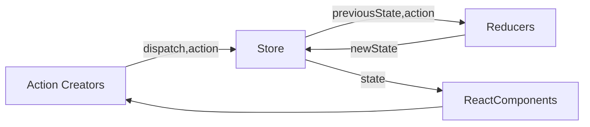
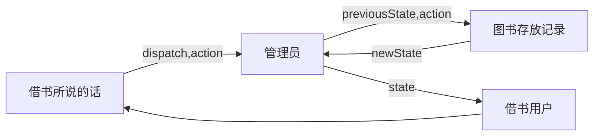

# React
## 安装React
* 安装React脚手架

```npm
npx create-react-app my-app
```

##  框架部分
### 函数组件(function)与class组件的区别及用法
* 自定义组件

```react
import React from 'react';

const App = () => {
  return (
    <div>
      hello React
    </div>
  );
}
export default App;
```

* class组件
```react
import React,{ Component } from 'react';

class TodoList extends Component{
  render() {
    return (
      <div>
        hello React
      </div>
    );
  }
}
export default TodoList;
```

* 两者区别：
|/|状态组件|生命周期|
|:-:|:-:|:-:|
|自定义|无|无|
|class|有|有|

* 有状态组件：有继承，可以通过this接受状态和属性，可以使用生命周期，增删改查数据，切记关注this的指向问题
* 无状态组件：数据通过父组件的props接收

### 子组件与父组件间的传值
* 单向数据流。父组件可以给子组件传值，但是子组件不能直接对父组件传值进行修改
#### 父组件向子组件传值
* 父组件通过属性传值给子组件

```javascript
//父组件
{
  this.state.list.map((item,index) => {
  return (
    <TodoItem content={item} />
    );
  })
}

//子组件通过this.props接收
return <div>{this.props.content}</div>
```

#### 子组件向父组件传值
* 父组件通过属性将方法传递给子组件(切记传递需要将this指向父组件)，子组件调用父组件方法，从而间接的使用父组件方法，进而发生页面改变

```javascript
//父组件
{
  this.state.list.map((item,index) => {
  return (
    <TodoItem content={item} 
    index={index} 
    DeleteItem={this.handLiDelete.bind(this)} />
    );
  })
}

//子组件通过this.props接收
return (
  //当然这里bind(this)可以写到constructor中，进行性能优化
    <div onClick={this.handItem.bind(this)}>
      {this.props.content}
    </div>)
handItem(){
  //调用父组件传递的函数，将父组件传递的index再次返回，进而调用父组件方法
    this.props.DeleteItem(this.props.index);
  }
```

### 对参数进行校验 props
* propTypes：对传递值进行校验

```javascript
import PropTypes from 'prop-types';

TodoItem.propTypes = {
  test: PropTypes.string.isRequired,//isRequired表示不许要传递，否则警告
  content: PropTypes.string,  //子组件接收值必须为string
  DeleteItem: PropTypes.func, //子组件接收值必须为function
  index: PropTypes.oneOfType([PropTypes.number,PropTypes.string])     //子组件接收值为number或者string
}
```

* defaultProps：默认值

```javascript
import PropTypes from 'prop-types';

TodoItem.defaultProps = {
  test: 'HELLO' //当test未接受到时使用默认值
}
```

## setState
* React修改state中的值需要调用setState函数
* 修改state中数据，建议拷贝副本后修改副本数据，在进行赋值，不要直接对state中修改
* setState会接收一个参数prevState表示修改数据之前的数据

```javascript
    this.setState((prevState) => ({
      list: [...prevState.list, prevState.inputValue],
      inputValue: ''
    }))
```

* setState第二个参数也是一个函数，当setState第一个函数执行完后，会执行第二个函数

## 虚拟DOM
* 原理
>1、state 数据
>2、JSX模板（JSX ->createElement ->虚拟DOM(JS对象) ->真实的DOM）
>
>>eg：<div id='abc'><span>hello world</span></div>

>3、根据JSX生成虚拟DOM（虚拟DOM就是一个JS对象，用来描述真实DOM）
>
>>eg：['div',{id: 'abc'},['span',{},'hello world']]

>4、数据 + 模板 结合生成真是的DOM，来显示
>5、state数据改变
>6、state+模板生成新的虚拟DOM
>
>>eg：['div',{id: 'abc'},['span',{},'bey bey']]

>7、比较原始虚拟DOM与新的虚拟DOM的区别	在此处优化了极大性能，这里使用了Diff算法，逐层比对，如果父级层不同，直接替换父级层及以下的内容，而不会再次比较
>8、直接操作DOM，改变页面内容

## JSX部分
* JSX使用js代码需要用花括号包裹：{ }
* JSX中如果使用自己的组件，开头字母须大写，一般小写的为H5的原始标签
* JSX使用js事件需要第二个字母大写：eg：onclick=>onClick
* 标签中设置类class是不规范的，需要使用className来代替
* 如果输入框不要转义标签需要设置属性：dangerouslySetInnerHTML={{__html: item}}，第一层花括号是因为在jsx中js对象要使用花括号包裹，第二层是里面包裹一个对象，当添加属性后，不需要再写入内容，标签内部会自动添加内容

* 如果标签中要使用for需要替换为htmlFor，否则会警告，例如label标签

## React生命周期函数
* 生命周期函数值在某一时刻组件会自动调用执行的函数
### 创建阶段
* Constructor()：初始化阶段
* componentWillMount()：挂载阶段，只执行一次
* reder()
* componentDidMount()：UI渲染完成，一般用来获取外部数据，只执行一次
### 更新阶段
* shouldComponentUpdate()：是否要继续执行render方法，可以用PureComponent替代，比较state和props，一般用来做优化
* componentDidUpdate()：UI组件更新后触发
### 卸载阶段
componentWillUnmount()：组件移除时调用，可以用来做资源释放
### 错误处理
componentDidCatch()

## React高级特性
### 函数组件
* 纯函数，输入props 输出render
* 没有实例，没有生命周期，没有state
* 不能扩展其他方法
* 可以使用Hooks
### 受控组件与非受控组件
* 受控组件：eg：input与state关联起来，类似于v-model
* 非受控组件：必须手动操作DOM元素，setState实现不了，文件上传，富文本编辑器

### Portals
* 组件会脱离父组件挂载到DOM树的任何位置上
* 使用场景：overflow：hidden，父组件z-index太小，fixed需要放在body第一层级

```javascript
import React from 'react'
import ReactDOM from 'react-dom'
import './style.css'

class ProtalsDemo extends React.Component {
    constructor(props) {
        super(props)
        this.state = {
        }
    }
    render() {
        // // 正常渲染
        // return <div className="modal">
        //     {this.props.children} {/* vue slot */}
        // </div>

        // 使用 Portals 渲染到 body 上。
        // fixed 元素要放在 body 上，有更好的浏览器兼容性。
        return ReactDOM.createPortal(
            <div className="modal">{this.props.children}</div>,
            document.body // 渲染目标DOM节点
        )
    }
}

export default ProtalsDemo
```

### 异步组件
* import()，React.lazy，React.Suspense
* 类似与vue异步加载
```javascript
import React from 'react';
// import ProtalsDemo from './ProtalsDemo';
// 异步加载组件
const ProtalsDemo = React.lazy(() => import('./ProtalsDemo'))

const BaseUser = () => {
  return (
        {/* 设置异步组件,fallback为加载过程中显示内容 */}
        <React.Suspense fallback={<div>Loading...</div>} >
          <ProtalsDemo />
        </React.Suspense>
  )
}
export default BaseUser
```

### 性能优化
* ShouldComponentUpdate (SCU)：通过对比返回true或false判断是否进行渲染
* PureComponent和React.memo：在react中起到浅比较
* 不可变值immutable.js：


### 高阶组件HOC
### Render Props

### vue中与react中event的区别
* vue：event是原生的，事件被注册到当前元素中
* react：event是SyntheticEvent，模拟出来DOM事件所有能力，event.nativeEvent 是原生事件对象，所有的事件都被挂载到document上，和 DOM 事件不一样，和 Vue 事件也不一样

## 动画部分
* 可以通过改变class属性来进行动画
* 切记把需要添加动画的标签设置为block或inline-block属性
### react-transition-group
* 通过react-transition-group模块实现动画[https://github.com/reactjs/react-transition-group]
* 安装eact-transition-group

```shell
# npm
npm install react-transition-group --save

# yarn
yarn add react-transition-group
```

* 如何使用

```javascript
import { CSSTransition } from 'react-transition-group';

  constructor(props) {
    super(props);
    this.state={
      show: true
    }
    //在需要执行动画JSX包裹此标签
    <CSSTransition
      //绑定state属性，大意就是在什么情况下执行那个动画
      in={this.state.show}
      //动画时间
      timeout={1000}
      //绑定class的属性名前缀
      classNames="fade"
      //动画结束后移除DOM
      unmountOnExit
      //挂载钩子函数
      onEntered={(el)=>{el.style.color='#f00'}}
      //初次加载执行动画
      appear={true}
     >
      <div>Hello Byron</div>
    </CSSTransition>
```

```css
.fade-enter,.fade-appear{
  /* 动画入场的第一帧 */  /* 动画初次的第一帧 */
  opacity: 0;
}
.fade-enter-active,.fade-appear-active{
  /* 动画入场的第二帧到倒数第二帧 */  /* 动画初次的第二帧到倒数第二帧 */
  opacity: 1;
  color: bisque;
  transition: opacity 2s ease-in-out;
}
.fade-enter-done,.fade-appear-done{
  /* 动画入场的最后一帧 */  /* 动画初次的最后一帧 */
  opacity: 1;
  color: aqua;
}
.fade-exit{
  /* 动画出场的第一帧 */
  opacity: 1;
}
.fade-exit-active{
  /* 动画出场的第二帧到倒数第二帧 */
  opacity: 0;
  color: darkviolet;
  transition: opacity 1s ease-in;
}
.fade-exit-done{
  /* 动画出场的最后一帧 */
  opacity: 0;
  color: #ff6700;
}
```

* 钩子函数
>onEnter：当入场动画第一帧时触发
>onEntering：当入场动画第二帧触发
>onEntered：当入场动画结束之后触发
>onExit：当出场动画第一帧时触发
>onExiting：当出场动画第二帧触发
>onExited：当出场动画结束之后触发

* **当样式与钩子函数冲突以钩子函数为准**
* 为多个标签添加样式

```javascript
import { CSSTransition, TransitionGroup } from 'react-transition-group';
<TransitionGroup>	//外层需要使用TransitionGroup包裹
          {
            this.state.list.map((item, index) => {
              return (
                <CSSTransition	//内部单个标签需要使用CSSTransition包裹
                  timeout={1000}
                  classNames="fade"
                  unmountOnExit
                  onEntered={(el) => { el.style.color = '#f00' }}
                  appear={true}
                  key={index}
                >
                  <div onClick={this.handDelect.bind(this,index)}>{item}                                 </div>
                </CSSTransition>
              )
            })
          }
        </TransitionGroup>
```

## Redux
#### Redux原理
* 原理：数据存入公共的Store，当某一组件在Store修改对应自己的数据后，其他组件会自动感知到数据的改变，进而进行页面的渲染
* 单一数据源，状态不可变，纯函数修改状态




#### Redux使用
* 安装Redux：[Git地址](https://github.com/zalmoxisus/redux-devtools-extension)

```shell
yarn add redux
```

##### Redux使用步骤
* 1、src下创建store文件，创建index,js文件，该文件是创建store仓库

```javascript
import { createStore } from 'redux';
import reducer from './reducer';
// 创建store仓库
const store = createStore(
  reducer,
  //这句代码是为了使用chrome的redux插件
  window.__REDUX_DEVTOOLS_EXTENSION__ && window.__REDUX_DEVTOOLS_EXTENSION__()
  );

export default store;
```

* 2、store文件下创建reducer.js文件，该文件是存储整个数据的
```javascript
// state:store上一次存储的数据
// action:用户传递的数据
const defaultState = {
  inputValue: 'hello',
  list: ['hello byron','hello redux']
};
// reducer 可以接收state，但是绝不能修改state
// reducer一定为纯函数：给定固定的输入，就一定会有固定的输出，而且不会有副作用
export default (state=defaultState, action) => {
  // 3、收到组件的传值，进行参数比较，并修改原始数据
  if(action.type === 'change_input_value'){
    // 不能直接修改state的数据，需要做一次深拷贝，对新值进行修改
    const newState = JSON.parse(JSON.stringify(state));
    // 将新数据赋值给原始数据
    newState.inputValue = action.value;
    // 返回给store
    return newState;
  }
  return state
}
```

* 3、引用数据||修改数据

```javascript
import store from './store/index'	//这里可以只写到./store，自动寻找store下的index
  constructor(props){
    super(props);
    // 1、调用getState()获取store中的数据
    this.state = store.getState();
    this.handStoreChange = this.handStoreChange.bind(this);
    this.handInputChange = this.handInputChange.bind(this);
    // 4、通过store.subscribe实时感知store的数据改变
    store.subscribe(this.handStoreChange);
  }
  
  render() {
    return (
      <input onChange={this.handInputChange} />
    )
  }
  handInputChange(event) {
    // 2、组件通过store.dispatch向store传值，store会自动将值传递给reducer
    const action = {
      type: 'change_input_value',
      value: event.target.value
    }
    store.dispatch(action);
  }
  handStoreChange() {
    //5、组件通过this.setState重新调用store.getState()获取最新数据
    this.setState(store.getState());
  }
```

#### Redux拆分使用
* 大概意思就是，当reducer的代码越来越多的时候，需要进行拆分，每个组件都创建store文件，然后主store文件下的reducer进行一 一引入并暴露给主store文件下的index
* 使用步骤：
>1、在子组件创建store文件并创建index.js和reducer.js文件，reducer.js文件为了存放本组件使用的数据以及对用操作，index.js文件主要是暴露本组件下的reducer文件，为了优化代码
```javascript
//子组件的reducer文件
const initState = ({
  focused: false
})

export default (state = initState, action) => {
  const newState = JSON.parse(JSON.stringify(state));
  switch (action.type) {
    case 'change_input_focus':
      newState.focused = true;
      return newState;
    case 'change_input_blur':
      newState.focused = false;
      return newState;
    default: return state;
  }
};
//子组件的index文件
//获取reducer文件
import reducer from './reducer';
//暴露reducer文件
export { reducer };
```

>2、主store文件的reducer文件接收各个子组件的reducer文件

```javascript
//在redux中引入combineReducers对不同文件中的reducer进行集中管理
import { combineReducers } from 'redux';
//直接引入reducer对应的文件就可以，在对应的文件中的index文件会引入自己的reducer并且导出，为了避免与主文件的reducer名字冲突，这里可以直接使用as做重命名
import {reducer as headerReducer } from '../common/header/store';

const reducer = combineReducers({
  header: headerReducer
});
export default reducer;
```

>3、对应的渲染页面需要进行对数据获取的修改，需要添加子组件对应的key值
```javascript
const mapStoreToProps = (state) => {
  return {
  	//focused: state.focused		//不拆分reducer
    focused: state.header.focused	//拆分reducer
  }
}
```

## 优化代码
* 一般会把action中的type中的数据重新定义到一个文件中为常量来使用，这样如果使用错误后，浏览器可以直接报错

```javascript
//store创建文件actionType.js设置
export const CHANGE_INPUT_VALUE = 'change_input_value';
export const ADD_LIST_VALUE = 'add_list_value';
export const DEL_LIST_VALUE = 'del_list_value';
//其他文件引用后使用
import { CHANGE_INPUT_VALUE,ADD_LIST_VALUE,DEL_LIST_VALUE } from './store/actionType';
```

* 一般会把action集中管理，这样便于代码的维护性，便于自动化测试

```javascript
//store创建文件actionCreators文件用于存放action内容
import { CHANGE_INPUT_VALUE } from './store/actionType';
export const gethandInputChange = (value) => ({
    type: CHANGE_INPUT_VALUE,
    value
});
//其他文件引用后使用
import { gethandInputChange} from './store/actionCreators';
handInputChange(event) {
    const action = gethandInputChange(event.target.value);
    store.dispatch(action);
  }
```

* UI组件与容器组件拆分，UI组件专门来渲染页面的，容器组件专门来编写逻辑的

```javascript
//AppUI页面，无状态组件，渲染更快，但也不是说不能写逻辑
import React,{ Fragment } from 'react';
import { Input, Button, List } from 'antd';
import { UserOutlined } from '@ant-design/icons';

const AppUI = (props) => {
  return(
    <Fragment>
      <div className="example-input">
        <Input size="large" placeholder="输入内容" prefix={<UserOutlined />}
          style={{ width: '600px', margin: '10px' }}
          value={props.inputValue}
          onChange={props.handInputChange}
        />
        <Button ghost onClick={props.handBtnClick}>提交</Button>
      </div>
      <List
        style={{width:'600px',margin:'10px'}}
        header={<div>Header</div>}
        footer={<div>Footer</div>}
        bordered
        dataSource={props.list}
        renderItem={(item,index) => (<List.Item onClick={() => {props.handListDelete(index)}}>{item}</List.Item>)}
      />
    </Fragment>
  )
}

export default AppUI;

//App页面
import AppUI from './AppUI';
  render() {
    return (
      <AppUI 
        inputValue={this.state.inputValue}
        list={this.state.list}
        handInputChange={this.handInputChange}
        handBtnClick={this.handBtnClick}
        handListDelete={this.handListDelete}
      />
    )
  }
```

## Redux-thunk
* [Git地址](https://github.com/reduxjs/redux-thunk)
* 作用：可以传递函数
### 安装redux-thunk

```shell
npm install --save redux-thunk
yarn add redux-thunk
```

### 使用redux-thunk为中间件发送Ajax
* 1、在创建store的文件中添加组件

```javascript
import { createStore,applyMiddleware,compose } from 'redux';
import reducer from './reducer';
import thunk from 'redux-thunk';
//1、创建chrome-redux扩展
const composeEnhancers = window.__REDUX_DEVTOOLS_EXTENSION_COMPOSE__ ? window.__REDUX_DEVTOOLS_EXTENSION_COMPOSE__({}) : compose;
//2、在applyMiddleware中添加thunk扩展
const enhancer = composeEnhancers(applyMiddleware(thunk));
//3、创建store仓库，并且添加以上组件
const store = createStore(reducer,enhancer);
export default store;
```

* 2、在actionCreators中添加ajax调用

```javascript
export const initListAction = (data) => ({
    type: init_List_Action,
    data
});
export const getStore = () => {
    // 因为使用了redux-thunk，多以可以return函数，dispatch可以通过函数传递过来
    return (dispatch) => {
        axios.get('/api/list.json').then((value) => {
            const data = value.data;
            //创建action重新走一遍redux流程
            const action = initListAction(data);
            //这里直接调用传递过来的dispatch方法就可以，不用引入store
            dispatch(action);
        }).catch((reason) => {
            console.log(reason);
        })
    }
}
```

* 3、在主组件中的生命周期中调用ajax方法

```javascript
  componentDidMount() {
    //创建action，走redux流程
    const action = getStore();
    store.dispatch(action);
  }
```

## Redux-saga
* [Git地址](https://github.com/redux-saga/redux-saga)
* 作用：将异步函数单独放入一个文件管理
### 安装redux-saga

```shell
npm install redux-saga
yarn add redux-saga
```

### 使用redux-saga为中间件发送Ajax
* 1、在创建store的文件中添加组件

```javascript
import { createStore,applyMiddleware,compose } from 'redux';
import createSagaMiddleware from 'redux-saga';
import reducer from './reducer';
import mySaga from './sagas';

//1、创建saga组件
const sagaMiddleware = createSagaMiddleware()
//2、创建chrome-redux扩展
const composeEnhancers = window.__REDUX_DEVTOOLS_EXTENSION_COMPOSE__ ? window.__REDUX_DEVTOOLS_EXTENSION_COMPOSE__({}) : compose;
//3、在applyMiddleware中添加saga中间件
const enhancer = composeEnhancers(applyMiddleware(sagaMiddleware));
//4、创建store仓库，并且添加以上组件
const store = createStore(reducer,enhancer);
//5、运行saga组件
sagaMiddleware.run(mySaga)
export default store;
```

* 2、主组件中创建action并传递

```javascript
  componentDidMount() {
    // 创建action发送调用发送ajax的函数，在这里调用dispatch，reducer和saga文件都会接收到
    const action = getSagaAjax();
    store.dispatch(action);
  }
```

* 3、actionCreators文件中编写action所调用的函数

```javascript
export const getSagaAjax = () => ({
  type: GET_SAGA_AJAX
})
```

* 4、创建sagas文件，编写异步函数

```javascript
import { put, takeEvery } from 'redux-saga/effects';
import { GET_SAGA_AJAX } from './actionType';
import { initListAction } from './actionCreators'
import axios from 'axios';

function* getajax() {
  // try，catch作用为了防止没获取到ajax报错问题
  try {
    const res = yield axios.get('/api/list.json');
    const action = initListAction(res.data);
    //使用saga的put方法发送数据给reducer
    yield put(action)
  }catch(error) {
    console.log('网络请求失败！')
  }
}


function* sagas() {
  //在这里使用takeEvery监听主组件传递action中type的值，当监听到后执行对应的方法
  yield takeEvery(GET_SAGA_AJAX, getajax);
}

export default sagas;
```

## react-redux
* 相当与对redux做了封装扩展，相当于redux的语法糖
### Provider组件
* 作用：当Provider组件关联store后，内部的所有组件也都自动连接store

### connect组件
* 作用：让当前组件与store做连接
* mapStoreToProps：将store的数据映射到该props中
* mapDispatchToProps：将store.dispatch方法挂在到props方法上

### 具体用法
* index.js文件引入react-redux以及Provider组件

```javascript
import React from 'react';
import ReactDOM from 'react-dom';
import App from './App';
//连接react-redux中的Provider组件
import { Provider } from 'react-redux';
import store from './store';
ReactDOM.render(
  //Provider组件与store建立连接，Provider的子组件也能够与store进行通信
    <Provider store={store}>
      <App />
    </Provider>,
  document.getElementById('root')
);
```

* App.js文件引入react-redux以及connect组件

```javascript
import React,{ Fragment } from 'react';
//连接react-redux中的connect组件
import { connect } from 'react-redux';
import { getinputvalue,getbtn,dellist } from './store/actionCreators';
//无状态组件,UI组件
const App = (props) => {
   //解构赋值
   const { inputValue,list,handChangeInput,handBtn,handdellist } = props;
 
   return(
     <Fragment>
       <input value={inputValue}
         onChange={handChangeInput}
       />
       <button onClick={handBtn}>提交</button>
       <ul>
         {
          list.map((item,index) => {
           return <li key={index} onClick={() => {handdellist(index)}}>{item}</li>
           })
         }
       </ul>
     </Fragment>
   )
}

//将store的数据映射到props中
const mapStoreToProps = (state) => {
  return {
    inputValue: state.inputValue,
    list: state.list
  }
}
//将store.dispatch方法挂在到props方法上
const maoDispatchToProps= (dispatch) => {
  return{
    handChangeInput(event) {
      const value = event.target.value;
      const action = getinputvalue(value);
      dispatch(action);
    },
    handBtn() {
      const action = getbtn();
      dispatch(action);
    },
    handdellist(index) {
      const action = dellist(index);
      dispatch(action);
    }
  }
}

//导出connect并于当前组件进行连接,当store数据发生改变，自动更新数据，连接AppUI组件形成一个容器组件并导出
export default connect(mapStoreToProps,maoDispatchToProps)(App);
```

## styled-components
### 安装styled-components

```shell
npm install --save styled-components
yarn add styled-components
```

* 作用：对单个组件进行样式的引用，防止不同组件见的css冲突，切记需要在每个css样式后面写分号，不然webpack会无法解析
### 使用styled-components的全局样式
* 创建style.js文件

```javascript
//创建全局样式
import { createGlobalStyle } from 'styled-components';
export const GlobalStyle = createGlobalStyle`
  margin: 0;
  padding: 0;
`;
```

* 在需要使用全局样式的组件中引入该组件

```javascript
import React,{ Component,Fragment } from 'react';
//引入全局样式
import { GlobalStyle } from './style';
import Header from './common/header'

class App extends Component {
  render() {
    return(
      <Fragment>
        {/* 使用全局样式 */}
        <GlobalStyle />
        <Header />
      </Fragment>
    )
  }
}

export default App;
```

### 使用styled-components的普通css
* 创建style.js文件

```javascript
//通过styled-components创建一个标记
import styled from 'styled-components';
//引入图片需要定义标记
import logoPng from '../../statics/logo.png';
//设置自定义组件Nav拥有div属性并赋予对应css属性
export const Nav = styled.div`
  height: 56px;
  border-bottom: 1px solid #f0f0f0;
`;
//可以在这里直接对标签进行属性的设置
export const Logo = styled.a.attrs({
  href: '/'
})`
  position: absolute;
  top: 0;
  left: 0;
  height: 56px;
  width: 100px;
  //设置图片需要这样写
  background: url(${logoPng});
  background-size: contain;
`;
export const InnerItem = styled.div`
  line-height: 56px;
  padding: 0 15px;
  font-size: 17px;
  color: #ccc;
  // 当组件用class属性值left的组件向左浮动
  &.left{
    float: left;
  }
  &.right{
    float: right;
  }
  &.action{
    color: #ea6f5a;
  }
`;
```

* 在需要使用样式的组件中引用该组件

```javascript
import React, { Component } from 'react';
import { Nav,HeaderWrapper,Logo,HeaderInner,InnerItem } from './style';

class Header extends Component {
  render() {
    return (
      <div>
        <Nav>
          <HeaderWrapper>
            <Logo />
            <HeaderInner>
              <InnerItem className="left action">首页</InnerItem>
              <InnerItem className="left">下载APP</InnerItem>
              <InnerItem className="right">登录</InnerItem>
              <InnerItem className="right">Aa</InnerItem>
            </HeaderInner>
          </HeaderWrapper>
        </Nav>
      </div>
    )
  }
}

export default Header;
```

### 使用styled-components传递参数
* 组件页面

```javascript
import React,{ Component } from 'react';
import { RecomWrapper, RecomItem } from '../style';

class Recommend extends Component {
  render() {
    return (
      <RecomWrapper>
        <RecomItem imgUrl='https://cdn2.jianshu.io/assets/web/banner-s-club-aa8bdf19f8cf729a759da42e4a96f366.png' />
      </RecomWrapper>
    )
  }
}
export default Recommend;
```

* 样式页面接收参数并使用

```javascript
export const RecomItem = styled.div`
  width: 280px;
  height: 50px;
  background: url(${(props) => props.imgUrl});
  background-size: contain;
`;
```


## immutable-js
* 作用：生成immutable对象，immutable是不可被改变的，怎样修改内容？通过set，get修改内容后，返回新的对象做替换，简介生成immutable对象
* 安装immutable

```shell
npm install immutable
yarn add immutable
```

### redux-immutable
* 作用：可以在redux中使用immutable，防止数据不断转换使用（一会使用js一会使用immutable）

## react路由
* 安装react-router-dom

```shell
yarn add react-router-dom
```
### 基本使用
* hash模式	（hash模式，带#号，刷新的时候页面不会丢失）
* browser模式	（browser模式，不带#号，通过本地api进行路由切换，刷新会都是数据，本地不会）
* 使用路由
```javascript
//通过react-router-dom引入BrowserRouter与Route
import { HashRouter, BrowserRouter, Route, Switch } from 'react-router-dom';
class App extends Component {
  render() {
    return(
      <Provider store={store}>
      //如过需要使用HashRouter直接替换BrowserRouter即可
          <BrowserRouter>
      //BrowserRouter中只能放一个child
            <Fragment>
     //Route可以渲染render，exact的作用是不重复渲染，当不加exact时路径/detail也会渲染出home
     //switch防止多次渲染
           <Switch>
                <Route path='/' exact component={Home}></Route>
                <Route path='/login' exact component={Login}></Route>
                <Route path='/detail/:id' exact component={Detail}></Route>
                <Route path='/write' exact component={Write}></Route>
           </Switch>
//<Route path='/detail' exact render={(() => <div>detail</div>)}></Route>
            </Fragment>
          </BrowserRouter>
      </Provider>
    )
  }
}
```

### react单页面路由跳转
```javascript
import { Link, NavLink } from 'react-router-dom';
//NavLink会动态添加一个active的类名
<Link to="/">
  <Logo />
</Link>
```

### 动态路由
* 第一步：一组件传递id值

```javascript
import { Link } from 'react-router-dom';
<Link to={`/detail/${item.get('id')}`>
  <Logo />
</Link>
```

* 第二步：主组件传递设置传递预定值

```javascript
import { BrowserRouter, Route } from 'react-router-dom';
<BrowserRouter>
  <Route path='/detail/:id' exact component={Detail}></Route>
</BrowserRouter>
```

* 第三步：二组件接收一组件传递值

```javascript
//如果是class组件
render() {
  console.log(this.props.match.params.id)
}
//如果是函数组件
const Detail = (props) => {
  console.log(props.match.params.id)
  return (
  )
}
```


### 路由重定向
```javascript
import { Redirect } from 'react-router-dom';
return <Redirect to="/" />
```


##  Hooks
* 简介：简单来说就是在不适用class组件的情况下进行逻辑操作
* 注意事项：所有的Hook都不能在条件语句中条件语句之后存在的
* 使用eslint-plugin-react-hooks插件检测语法

```shell
#安装
yarn add eslint-plugin-react-hooks
```
```json
//package.json设置
"eslintConfig": {
    "extends": "react-app",
    "plugins": [
      "react-hooks"
    ],
    "rules": {
      "react-hooks/rules-of-hooks": "error",
      "react-hooks/exhaustive-deps": "warn"
    }
  }
```

### useState使用
* 不能存在与条件判断语句中，按照顺序执行
* 使用方法

```javascript
import React, { useState } from 'react'

const StateDemo = (props) => {
  // useState可以存放一个函数，用来延迟初始化获取值
  const [count, setCount] = useState(() => {
    console.log('打印一次')
    // 返回初始值给count
    return props.defaultCount || 0
  })
  const [name, setName] = useState('byron')
  const [sex, setSex] = useState('男')
  return(
    <div>
      <p>this is useState:{count}</p>
      <p>姓名：{name}，性别：{sex}</p>
      <button onClick={() => {setCount(count+1)}}>click</button>
    </div>
  )
}

export default StateDemo
```

### useEffect使用
* 异步，不会阻断视图的更新
* 简介：class组件可以使用钩子函数进行副作用，函数组件则可以使用useEffect进行类似钩子函数的作用
* 第二个参数：如果不传递，证明每次都执行，如果传递数组，当数组的每一项都不变的话，useEffect才不会执行，如果传毒空数组，则只在第一次执行一次/
* 使用方法

```javascript
// useRffect模拟componentDidMount与componentDidUpdate
import React, { useState ,useEffect } from 'react'

const EffectDemo = () => {
  const [count, setCount] = useState(0)
  // 类似与componentDidMount
  useEffect(() => {
    console.log(`count: ${count}`)
  }, [])

  // 类似与componentDidUpdate，但是页面挂载完也会执行，当count更新时执行函数
  useEffect(() => {
    console.log(`updata: ${count}`)
  }, [count])
  
  // 没有第二个参数，则组件更新就会触发函数调用
  useEffect(() => {
    // console.log(`------${count}--------`)
    console.log('1')
  })
  return(
    <div>
      <p>{count}</p>
      <button onClick={() => {setCount(count+1)}}>click</button>
    </div>
  )
}
export default EffectDemo
```

```javascript
// useRffect模拟componentWillUnmount
import React, { useState ,useEffect } from 'react'
import { BrowserRouter as Router, Route, Link } from 'react-router-dom'

// 子组件一
const Index = () => {
  useEffect(() => {
    console.log(`我是首页的`)
    return () => {
    // 回调函数中类似componentWillUnmount，可以进行解除自定义函数等等
      console.log('离开首页')
    }
  }, []) // 这里别忘记添加[]，如果不添加[]则父组件更新也会执行函数
  return(
    <h1>我是首页</h1>
  )
}

// 子组件二
const List = () => {
  useEffect(() => {
    console.log(`我是List的`)
    return () => {
    // 回调函数中类似componentWillUnmount
      console.log('离开list')
    }
  }, []) // 这里别忘记添加[]，如果不添加[]则父组件更新也会执行函数
  return(
    <h1>我是List</h1>
  )
}

const EffectDemo = () => {
  const [count, setCount] = useState(0)
  useEffect(() => {
    console.log(`------${count}--------`)
  }, [count])
  return(
    <div>
      <p>{count}</p>
      <button onClick={() => {setCount(count+1)}}>click</button>

      <Router>
        <ul>
          <li><Link to='/'>首页</Link></li>
          <li><Link to='/list'>列表</Link></li>
        </ul>
        <Route path='/' exact component={Index} />
        <Route path='/list' exact component={List} />
      </Router>
    </div>
  )
}

export default EffectDemo
```

### useRef使用
* 作用一：获取元素DOM
* 作用二：作为函数内的全局变量，渲染周期之间共享数据的存储，但是目前不能存储函数

```javascript
// 作用一
import React, { useState, useEffect, useRef } from 'react';

const Fetch = () => {
  const [result, setRes] = useState(0)
  const countRef = useRef(null)

  useEffect(() => {
    console.log(1)
    const handBtn = () => {
      setRes(result + 1)
    }
    //countRef.current可以获取对应ref的DOM
    countRef.current.addEventListener('click', handBtn)
    return () => countRef.current.removeEventListener('click', handBtn)
  }, [result])
  
  return (
    <div>
      result: {result}
      <button ref={countRef}>+1</button>
    </div>
  )
}

const App = () => {
  return (
    <div>
      <Fetch />
    </div>
  );
}

export default App;
```

```javascript
// 作用二
import React,{ useRef, useState, useEffect } from 'react'

const App = () => {
  const [count, setCount] = useState(0)
  // 将定时器设置为useRef进行保存属性，如果不使用useRef进行保存，那么更新都会重新定义timer，然后定时器则不会自动停止
  const timer = useRef()
  useEffect(() => {
    // 将timer的current绑定到定时器中
    timer.current = setInterval(() => {
      setCount(count => count + 1)
    }, 1000)
  }, [])

  useEffect(() => {
    if (count > 10) {
      // 直接移除timer的current即可移除定时器
      clearInterval(timer.current)
    }
  })

  return(
    <div>
      <h1>{count}</h1>
    </div>
  )
}

export default App

```

### memo，useMemo，useCallback	---	 优化
#### memo
* 简介：优化函数组件的重渲染行为，当传入属性不变的情况下就不会触发重新渲染，否则进行渲染
* memo与PureComponent作用一样，都是用来减少组件渲染，只不过memo在函数组件中使用，PureComponent在类组件中使用
* 使用方法

```javascript
import React, { memo } from 'react';
const Child = memo(({ seconds }) => {
  console.log('I am rendering');
  return (
    <div>I am update every {seconds} seconds</div>
  )
})
export default Child;
```

* React.memo()可接受2个参数，第一个参数为纯函数的组件，第二个参数用于对比props控制是否刷新，与shouldComponentUpdate()功能类似，比较prev与next是否相等，相等返回true不更新，不相等返回false则更新

```javascript
import React, { memo } from 'react';
const Child = memo(({ seconds }) => {
  console.log('I am rendering');
  return (
    <div>I am update every {seconds} seconds</div>
  )
}, (prev, next) => {
  //如果相等为true则不更新，反之则更新，一般进行深度比较的话需要使用第二个参数
  return prev.seconds === next.seconds
})
export default Child;
```

#### useMemo
* 简介：用法类似与useEffect，根据第二个参数进行判断是否进行渲染组件，需要return方法，与useEffect区别，useEffect的return在渲染后执行，useMemo的return可以直接参与渲染， 是在渲染期间执行的
* 本质是定义一段函数是否重复执行

```javascript
  const double = useMemo(() => {
    return count * 2
  }, [count])
  // 当然也可以用useMemo做参数，但是不推荐
  const helf = useMemo(() => {
    return double * 2
  }, [double])
```

#### useCallback
* 简介：缓存一个函数，一般父组件传递子组件的函数需要使用useCallback包裹
* 使用方法

```javascript
import React, { memo, useState, useCallback } from 'react';

const Child = memo((props) => {
  console.log(1)
  return (
    <div>
      <input text="text" onChange={props.content} />
    </div>
  )
})

const Parent = () => {
  const [text, setText] = useState('')
  //如果不使用useCallback，当Parent改变后，Child组件也会发生变化
  //使用useCallback后，则优先获取缓存中的值
  const handOnChange = useCallback((e) => {
    setText(e.target.value)
    //如果不需要依赖，添加空依赖就可以
  }, [])
  return (
    <div>
      <p>text:{text}</p>
      <Child content={handOnChange} />
    </div>
  )
}

const App = () => {
  return (
    <div>
      <Parent />
    </div>
  );
}
export default App;
```

### 自定义Hooks
* 命名以use开头
* 使用方法
>自定义hook

```javascript
import { useState, useEffect } from 'react';
//可以接收到父组件的参数props
export const useWidowHook = (props) => {
  const [width, setWidth] = useState('0px');
  const [height, setHeight] = useState('0px');
  useEffect(() => {
    setWidth(document.documentElement.clientWidth + 'px')
    setHeight(document.documentElement.clientHeight + 'px')
  }, [])

  useEffect(() => {
    const handChangeSize = () => {
      setWidth(document.documentElement.clientWidth + 'px')
      setHeight(document.documentElement.clientHeight + 'px')
    }
    window.addEventListener('resize', handChangeSize)
    return () => {
      window.removeEventListener('resize', handChangeSize)
    }
  }, [])
  //导出对应的数据
  return [width,height]
}
```

>父组件引入自定义hook

```javascript
import React from 'react';
//引入自定义HOOKs
import { useWidowHook } from './windowHook';

const Parent = (props) => {
  //解构自定义hooks,可以传递父组件的参数props
  const [width, height] = useWidowHook(props)  
  return (
    <div>
      size: {width}, {height}
    </div>
  )
}

const App = () => {
  return (
    <div>
      <Parent />
    </div>
  );
}
export default App;
```

### useReducer,useContext使用
* useState的实现是基于useReducer的
* useReducer解决状态共享，useContext解决父子组件传值
* 使用方法

```javascript
// 单一useContext使用
import React, { useState, useContext } from 'react'

// 创建Context对象
const CountContext = React.createContext()
// 子组件
const ContextSon = () => {
  // 设置变量接收父组件传递值
  let count = useContext(CountContext)
  return(
    <h1>这是子组件：{count}</h1>
  )
}
// 父组件
const ContextDemo = () => {
  const [count, setCount] = useState(0)
  return(
    <div>
      <p>这是父组件：{count}</p>
      <button onClick={() => {setCount(count+1)}}>click</button>
      {/* 需要将父组件的count传递到子组件中 */}
      <CountContext.Provider value={count}>
        <ContextSon />
      </CountContext.Provider>
    </div>
  )
}

export default ContextDemo
```

```javascript
// 单一使用useReducer
import React,{ useReducer } from 'react'

const ReducerDemo = () => {
  // 定义一个reducer,第二个参数为count的初始值
  const [count, dispatch] = useReducer((state, action) => {
    switch(action){
      case 'add':
        return state + 1
      case 'sub':
        return state - 1
      default:
        return state
    }
  }, 0)

  return (
    <div>
      <p>当前数字为：{count}</p>
      <button onClick={() => {dispatch('add')}}>增加</button>
      <button onClick={() => {dispatch('sub')}}>删除</button>
    </div>
  )
}

export default ReducerDemo
```

### useSelector,useDispatch使用

* 简介，替代原有的connect，useSelector相当于mapStateToProps，useDispatch相当于mapDispatchToProps

```javascript
import React, { useCallback } from 'react';
import { useSelector, useDispatch } from 'react-redux';

const Write = () => {
  //通过useSelector获取store的值
  const Data = useSelector((state) => {
    return {
      value： state.getIn(['detail', 'values'])
    }
  })
  //创建useDispatch
  const dispatch = useDispatch()
  const handchange = useCallback((e) => {
    const action = {
      type: 'change',
      value: e.target.value
    }
    dispatch(action)
  },[dispatch])
  return (
      {/* 通过useSelector返回值所对应的值获取返回值 */}
      <input value={valueData.value} onChange={handchange} />
  )
}

export default Write;
```

##  Hooks与生命周期的关联
* 类组件中初始化数据一般在constructor中进行，hooks则使用useState进行初始化
* 类组件中静态方法getDerivedStateFromProps根据新的属性值和当前的状态返回新的状态，hooks则可以在useState后立即执行比较操作执行setstate
* 类组件判断是否需要进行渲染使用shouldComponentUpdate，函数组件使用memo
* componentDidMount与componentDidUpdate与componentWillUnmount使用函数组件的useEffect


## context是什么，有和用途
* 可以获取父级传递的内容，从而不用props一层一层向下传递

```javascript
// 三种传递方式
import React, { useState ,useContext } from 'react'

// 创建context对象
const CountText = React.createContext()

// 基础context写法（子组件）
class Foo extends React.Component {
  render() {
    return (
      <CountText.Consumer>
        {
          count => <h1>{count}</h1>
        }
      </CountText.Consumer>
    )
  }
}
//使用contextType写法，只适用类组件（子组件）
class Bar extends React.Component {
  static contextType = CountText
  render() {
    const count = this.context
    return(
      <h2>{count}</h2>
    )
  }
}
// 使用后useContext写法（子组件）
const Tex = () => {
  const count = useContext(CountText)
  return(
    <h3>{count}</h3>
  )
}

// （父组件）
const ContestDemo = () => {
  const [count, setCount] = useState(0)
  return (
    <div>
      {/* value：定义传递内容 */}
      <CountText.Provider value={count}>
        context写法：<Foo />
        contextType写法<Bar />
        useContext写法<Tex />
      </CountText.Provider>

      <button onClick={() => {setCount(count + 1)}}>click</button>
    </div>
  )
}


export default ContestDemo

```

## React异步加载组件(react-loadable)
* 安装

```shell
yarn add react-loadable
```

* 使用方法

```javascript
//创建loadable文件引入需要异步加载文件
import React from 'react';
import Loadable from 'react-loadable';

const LoadableComponent = Loadable({
  loader: () => import('./index'),
  loading () {
    return(
      <div>正在加载</div>
    )
  }
});

export default () => <LoadableComponent/>;
```
```javascript
//主组件文件中如果有传递参数需要使用withRouter进行封装
import { useDispatch } from 'react-redux';
export default withRouter(Detail);
```

##  跨域
### 正向代理--开发环境
* 一个位于客户端和目标服务器之间的代理服务器，为了获取到目标服务器的内容，客户端向代理服务器发送一个请求，代理服务器帮助我们去目标服务器里面获取数据并且返回给我们

### 反向代理--上线环境
* 可以通过代理服务器来接受网络上的请求代理，然后将这个请求转发给内部的网络服务器上，并且把这个服务器上得到的数据返回给请求的客户端，这个时候代理服务器就是一个反向代理的过程

```javascript
// node_modules\react-scripts\config>webpack.config.js中设置
proxy: {
      '/weather_mini/': {
        target: 'http://wthrcdn.etouch.cn',
        changeOrigin: true
      }
    }
```

* 引用插件方式：

```shell
npm install http-proxy-middleware
```

* 使用方式：创建：src/setupProxy.js

```javascript
const { createProxyMiddleware } = require('http-proxy-middleware');

module.exports = function(app) {
  app.use('/byron', createProxyMiddleware({
    target: 'http://192.168.199.190:10010',
    // target: 'http://172.20.10.3:10010',
    changeOrigin: true,
    pathRewrite:{
      '/byron': ''
    }
  }))
}
```


## ReactUI组件库
### antd
* 安装antd
```npm
npm install antd --save
yarn add antd
```

### 使用antd[https://ant.design/index-cn]
```javascript
import 'antd/dist/antd.css';
import { Input, Button } from 'antd';

<div style={{ margin: '10px' }}>
  <Input placeholder="todulist"
    style={{ width: '500px', marginRight: '10px' }}></Input>
  <Button type="primary">提交</Button>
</div>

```

## React安装scss
```shell
# 很大一部分可能是源的问题
npm install node-sass --sass_binary_site=https://npm.taobao.org/mirrors/node-sass/
```

## react安装swiper
* 安装

```shell
npm install reactjs-swiper --save
# 也可以使用这个：查文档
yarn add react-id-swiper@latest swiper@latest
```

* 使用

```javascript
import React, {Component} from 'react';
import {render} from 'react-dom';
import ReactSwiper from 'reactjs-swiper';
import './sass/example.scss'; // 自定义 css
 
const ReactSwiperExample = () => {
  const items = [{
    image: 'http://alloyteam.github.io/AlloyTouch/example/asset/ci1.jpg',
    title: '图片1',
    link: 'http://jd.com'
  }, {
    image: 'http://alloyteam.github.io/AlloyTouch/example/asset/ci2.jpg',
    title: '图片2',
  }, {
    image: 'http://alloyteam.github.io/AlloyTouch/example/asset/ci3.jpg',
    title: '图片3',
    link: 'http://jd.com'
  }, {
    image: 'http://alloyteam.github.io/AlloyTouch/example/asset/ci4.jpg',
    title: '图片4',
  }];
 
  const swiperOptions = {
    preloadImages: true,
    autoplay: 4000,
    autoplayDisableOnInteraction: false
  };
  return (
    <ReactSwiper swiperOptions={swiperOptions} showPagination items={items}
                 className="swiper-example" />
  );
};
 
render(
  <ReactSwiperExample />, document.getElementById('layout')
);
```

## 常见注意事项
* 如果一个页面引用JSX语法，那么必修引入import React from 'react';否则无法编译！！！
* <React.StrictMode></React.StrictMode>：React严格模式
* 当父组件的render函数被运行时，子组件的render将会被重新加载
* 当组件的state或者props发生改变的时候，render函数会重新执行
* React提升性能有哪些：
>1、this.xxxx.bind(this)放入constructor中
>2、使用setState函数，因为是一个异步函数，会把对此修改数据结合成一次，减少虚拟DOM比对频率
>3、shouldComponentUpdate中的nextProps判断子组件内容是否与之前相同，如果相同则返回false，不进行之后的渲染，如果不同则再进行渲染

* 使用charles模拟数据时需要访问：http://localhost.charlesproxy.com:3000/，切记切记切记，关闭代理模式，比如xxx访问助手
* ref获取DOM节点：<span *ref*={(*icon*) => {this.Icon = icon}} *className*='iconfont'>icon</span>
* PureComponent与Component区别：PureComponent会自动添加shouldComponentUpdate()生命周期，进行性能优化，可以避免加载不必要的数据


## DvaJS
### DvaJS是什么
* dva 首先是一个基于 redux 和 redux-saga 的数据流方案，然后为了简化开发体验，dva 还额外内置了 react-router 和 fetch，所以也可以理解为一个轻量级的应用框架

### 安装 dva-cli
```shell
# 全局安装脚手架
npm install dva-cli -g
# 创建项目
dva new 项目名称
# 启动项目
npm run start
```

### dva使用antd
* 安装切记使用cnpm

```shell
npm install antd babel-plugin-import --save
```

* 在.webpackrc文件中配置

```
{
  "extraBabelPlugins": [
    ["import", { "libraryName": "antd", "libraryDirectory": "es", "style": "css" }]
  ]
}
```
* 文件引入并使用antd
```javascript
import { Button } from 'antd';
function IndexPage() {
  return (
    <Button type="primary">Primary Button</Button>
  )
}
export default IndexPage
```

### dva路由
####  dva路由配置
* 在routes文件下创建页面文件，然后添加带index.js文件中
```javascript
// 创建页面文件
import React from 'react';

const Products = (props) => (
  <h2>List of Products</h2>
);

export default Products;

// 添加只index.js文件中
import Products from './routes/Products';
<Route path="/products" exact component={Products} />
```

#### dva路由设置为browserHistory
* 首先安装history
```shell
cnpm install --save history
```
* 在入口文件index.js进行配置
```javascript
import { createBrowserHistory as createHistory } from 'history';
const app = dva({
  history: createHistory(),
});
// 这样就可以省略掉很low的#号啦
```
#### dva路由跳转
* 方法一：Link跳转
```javascript
import { Link } from 'dva/router';
const Product = (props) => {
  return(
    <Link to='/'>跳转首页</Link>
  )
}
```

* 方法二：history跳转
```javascript
// 如果在子页面进行跳转，需要父级路由页面将history传递给子UI页面
// 父级页面传递history
import React from 'react';
import Product from '../../components/Product';
class IndexPage extends React.Component{
  render() {
    const { history } =this.props
    return(
      <Product history={ history }/>
    )
  }
}
export default IndexPage

// 子UI页面进行history跳转
import React, { useCallback } from 'react';
const Product = (props) => {
  const gotoIndex = useCallback(() => {
  // 进行history跳转
    props.history.push('/')
  })
  return(
    <button onClick={ gotoIndex }>去首页</button>
  )
}
export default Product;
```

* 方法三：withRouter跳转 
```javascript
import React, { useCallback } from 'react';
import { withRouter } from 'dva/router';
const Product = (props) => {
  const gotoIndex = useCallback(() => {
    props.history.push('/')
    // 可以获取父级所有props属性
    console.log(props)
  })
  return(
    <button onClick={ gotoIndex }>去首页</button>
  )
}
export default withRouter(Product);
```

* 方法四：routerRedux跳转
```javascript
import React, { useCallback } from 'react';
import { routerRedux } from 'dva/router';
const Product = (props) => {
  const gotoReduxIndex = useCallback(() => {
    props.dispatch(routerRedux.push('/'))
  })
  return(
    <button onClick={ gotoReduxIndex }>redux去首页</button>
  )
}
export default Product;
```

### dva编写UI组件
* 首先UI组件一般存放在components中，然后编写完成UI组件后可以在路由组件中进行引入使用

### dva Model创建
* 解释：dva Model是集成state，reducers为一体的redux（个人理解）
* 在models中创建文件后必须有namespace属性，该属性确定了redux中的父级
```javascript
// 示例
export default {
// 定义model的名称
  namespace: 'product',
  // 设置初始数据
  state: {
    productList: [
      {
        name: 'byron'
      },
      {
        name: 'hashe'
      }
    ]
  },
  // reducer设置
  reducers: {
    updataList(state, action) {
      let currentList = deepClone(state)
      currentList.productList.push(action.payload)
      return currentList
    }
  },
  //  进行异步操作.一般在这里获取网络数据
  effects: {
    *asyncdataList({ payload }, { call, put }) {
      yield put({
        type: 'updataList',
        payload
      })
    }
  }
}
// 设置自定义函数
// 深度克隆
function deepClone(arr){
  let _obj = JSON.stringify(arr),
      objclone = JSON.parse(_obj)
  return objclone
}
```

### dva的Mock数据处理
* 首先在mock文件下创建mock（这里示例为product.js文件）文件
```javascript
// GET
module.exports = {
  "GET /api/product": {"name": "大豆"}
}
// POST
module.exports = {
  "POST /api/login": (req, res) => {
    res.send({
      msg: '登录成功'
    })
  }
}
```
* 第二步：在.roadhogrc.mock.js文件下进行处理
```javascript
// 单个文件处理
export default {
  ...require("./mock/product")
};
// 多个文件处理
import fs from 'fs';
import path from 'path';

const mock = {}
fs.readdirSync(path.join(__dirname + '/mock')).forEach(function (file) {
    if (file.match(/\.js$/)) {
        Object.assign(mock, require('./mock/' + file))
    }
})
export default mock
```
* 第三步：在services下的example.js文件下进行声明
```javascript
import request from '../utils/request';
export function getProduct() {
  return request('/api/product')
}
```
* 最后一步：组件中进行访问数据
```javascript
import React, { useEffect } from 'react';
import * as api from '../services/example';
...
useEffect(() => {
    api.getProduct().then(res => {
      console.log(res)
    })
  })
...
```


