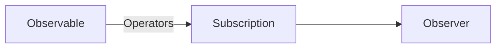
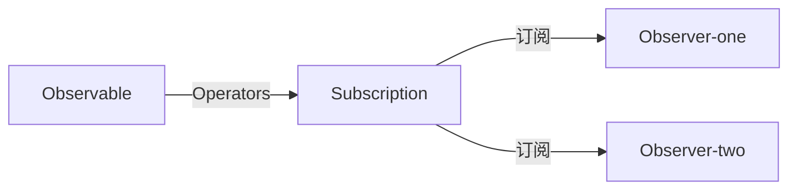

# ReactiveX JavaScript（Rxjs）
* 什么是Rxjs：一组可用来处理**异步**和**事件**的JavaScript函数库
* Rxjs专门来处理stream（串流）数据，很适合处理异步操作，举个例子：假如有五个请求数据，返回数据顺序要与请求顺序相同，那么使用js就比较不容易，但是使用rxjs就非常容易
* 有人订阅观察行为才会启动

## 为什么要使用Rxjs？
1. 代码简洁明了
2. rxjs里提供的很多原生js难以实现的功能
3. Observable可以发送多个任意类型的值，无论这些值是同步发送的还是异步发送的，接收这些值的 API 都是一样的，由于开始和结束都是由Observable自己处理的，所以你的应用代码只管订阅并消费这些值就可以了，做完之后，取消订阅

## 核心概念
* Observable (可观察对象): 表示一个概念，这个概念是一个可调用的未来值或事件的集合，简单来说：如果在页面上订阅一个click事件，那么这个click就是一个可以被观察的事件，然后click后发出一系列的事件，然后这整件事是可以被观察的称为Observable。
* Observer (观察者): 一个回调函数的集合，它知道如何去监听由 Observable 提供的值，简单来说：就是监听Observable异步回调过来的数据。
* Subscription (订阅): 表示 Observable 的执行，主要用于取消 Observable 的执行，简单来说：Observer观察Observable的资料，整个过程称之为Subscription，
* Operators (操作符): 采用函数式编程风格的纯函数 (pure function)，使用像 map、filter、concat、flatMap 等这样的操作符来处理集合。简单来说：就是Observable到Observer中间可以过滤资料的运算值
* Subject (主体): 相当于 EventEmitter，并且是将值或事件多路推送给多个 Observer 的唯一方式，简单来说：就是可以获取一个Observable发出的资料，然后分发给对应的Observer，类似于广播的意思
* Schedulers (调度器): 用来控制并发并且是中央集权的调度员，允许我们在发生计算时进行协调，例如 setTimeout 或 requestAnimationFrame 或其他。

* 产生Observable (可观察对象)；通过pipeAPI传入Operators (操作符)，不止一个；通过Subscription (订阅)传入Observer (观察者)






### 非同步常见的问题
* 竞态条件(Race Condition)：每当我们对同一个资源同时做多次的非同步存取时，就可能发生Race Condition 的问题。比如说我们发了一个Request 更新使用者资料，然后我们又立即发送另一个Request 取得使用者资料，这时第一个Request 和第二个Request 先后顺序就会影响到最终接收到的结果不同，这就是Race Condition
* 内存泄漏(Memory Leak)：内存泄漏是最常被大家忽略的一点。原因是在传统网站的行为，我们每次换页都是整页重刷，并重新执行JavaScript，所以不太需要理会记忆体的问题！但是当我们希望将网站做得像应用程式时，这件事就变得很重要。例如做SPA (Single Page Application)网站时，我们是透过JavaScript来达到切换页面的内容，这时如果有对DOM注册监听事件，而没有在适当的时机点把监听的事件移除，就有可能造成Memory Leak。比如说在A页面监听body的scroll事件，但页面切换时，没有把scroll的监听事件移除
* 错误处理(Exception Handling)：JavaScript 的try/catch 可以捕捉同步的例外，但非同步的程式就没这么容易，尤其当我们的非同步行为很复杂时，这个问题就愈加明显
* 复杂的状态(Complex State)：当有非同步行为时，应用程式的状态就会变得非常复杂！比如说我们有一支付费用户才能播放的影片，首先可能要先抓取这部影片的资讯，接着我们要在播放时去验证使用者是否有权限播放，而使用者也有可能再按下播放后又立即按了取消，而这些都是非同步执行，这时就会各种复杂的状态需要处理

## 常用Observable
* of：同步传递一些值
* from：可以接受一个数组或字符串，接受数组返回数组中单个值，接受字符串返回字符串单个值，也可以传递一个promise
* fromEvent：第一个参数要传入DOM 物件，第二个参数传入要监听的事件名称
* interval：会每隔规定时间抛出一个从零开始递增的整数
* timer：两个参数时，第一个参数代表要发出第一个值的等待时间(ms)，第二个参数代表第一次之后发送值的间隔时间，一个参数时，等待指定时间后发出一个值
* concat：把多个observable 实例合并成一个，必须先等前一个observable完成(complete)，才会继续下一个
* merge：把多个observable 实例合并成一个，多个observable同时进行处理
* zip：将多个Observable组合以创建一个Observable，该Observable的值是由所有输入的Observables的值按顺序计算而来的
* range：发出范围内数组序列，range(1,10) 发出1-10

## 常用Operators
* take：取前多少笔数
* filter：进行过滤 Boolean
* map：遍历每个值并通过传入callback进行输出
* mapTo：可以把传进来的值改成一个固定的值
* first：取第一笔，与take(1)一致
* takeUntil：他可以在某件事情发生时，让一个observable 直送出完成(complete)讯息
* skip：略过前几笔数
* takeLast：取最后几笔
* last：取最后一笔
* startWith：在发出数据前塞入一个指定值
* withLatestFrom：使用最新的值执行callback
* scan：累加效果，类似于数组的reducer
* buffer：把上游的多个数据缓存起来，当时机合适时再把汇聚的数据传给下游
* bufferTime：把上游的多个数据缓存起来，等待指定时机更新数据
* bufferCount：把上游的多个数据缓存起来，等待指定数量更新数据
* delay：延迟指定时间后触发
* debounce：防抖，传入回调函数，在指定回调时间内发送出最新数据，收到一个事件后等一段时间，如果没有收到其他事件，才处理这个事件
* debounceTime：防抖，传入指定时间，在指定时间内发送出最新数据
* throttle：节流，传入回调函数，在指定回调时间内发送出最新数据
* throttleTime：节流，传入指定时间，在指定时间内发送出最新数据
* distinct：过滤操作，如果有重复的值，就被过滤掉
* distinctUntilChanged：过滤操作，每次都拿当前元素的后一个进行比较
* retry：当发生错误时重新尝试，可以设置尝试次数
* retryWhen：可以传递一个callback对错误进行操作
* repeat：重复操作，可以设置重复次数
* tap：可以直接在pipe中获取当前数据流，且不影响数据流，透明地打印数据流中的值

## 小案例
* 监听事件案例

```javascript
import { fromEvent } from 'rxjs'

// 建立一个可观察的Observable物件
this.click$ = fromEvent(document, 'dblclick')
// 建立观察者Observer
this.observer = {
  // next：每当Observable 发送出新的值，next 方法就会被呼叫
  next: (value) => console.log(value),
  // complete：在Observable 没有其他的资料可以取得时，complete 方法就会被呼叫，在complete 被呼叫之后，next 方法就不会再起作用
  complete: () => console.log('complate'),
  // error：每当Observable 内发生错误时，error 方法就会被呼叫
  error: (error) => console.log(error),
}
// 建立订阅关系
this.subs$ = this.click$.subscribe(this.observer)

// 取消订阅关系
this.subs$.unsubscribe()
```

* Subject (主体)案例
```javascript
// 创建Subject对象
this.subject = new Subject()
// 建立一个可观察的Observable物件并且只取前20个
this.click$ = fromEvent(document, 'click').pipe(take(20))
// 设定将this.click$全部交由this.subject主体进行广播
this.click$.subscribe(this.subject)
// 建立观察者Observer
this.observeX = {next: (x => console.log(`clientX: ${x.clientX}`))}
// 建立观察者Observer
this.observeY = {next: (x => console.log(`clientY: ${x.clientY}`))}
// 由this.subject去家里observe观察者物件
this.sub1$ = this.subject.subscribe(this.observeX)
this.sub2$ = this.subject.subscribe(this.observeY)
```

* 接口失败后尝试延迟且多次调用（retry）
* 输入框获取最后一个接口数据 （debounceTime）


## Rxjs对于Promise的比较？
1. rxjs是声明式的也就是在没有被订阅前是不会执行的，promise在创建后就会立即执行，从而rxjs可以按需执行
2. rxjs可以提供多个值，promise只能提供一个值，让rxjs可用于随着时间的推移获取多个值，比如说添加一个click事件，持续点击就会不断触发，但是promise就不会持续获取最新值
3. rxjs区分处理于订阅语句，promise只有.then语句，让rxjs可以创建供其他地方使用而不希望被执行的Observable，rxjs在订阅前可以获取值，而promise只有在then后获取值
4. rxjs的subscribe会负责处理错误或者在数据流中使用对应的Operators处理错误（catchError），promise错误处理会在then/catch中，让rxjs可以进行集中式，可预测的处理错误
5. rxjs是可以取消的unsubscribe，promise需要二次封装后才可以进行取消操作

## Rxjs对于events API的比较？
1. rxjs与events事件处理很像，有一个不同就是rxjs可以配置可观察对象，使其在把事件传给事件处理器之前进行转换

## Rxjs对于数组的比较？
1. rxjs是随着时间生成值，数组是一组静态的值，也就是说Observable是异步的，数组是同步的

## Rxjs地址链接？
1. rxjs官网：https://rxjs.dev/
2. rxjs-github：https://github.com/ReactiveX/rxjs （24K Star）
3. rxjs图解：https://reactive.how/rxjs/
4. rxjs弹珠图：https://rxmarbles.com/ （rxjs版本为5.0.3，相对较低）
5. rxjs-hooks：https://github.com/LeetCode-OpenSource/rxjs-hooks
6. 打通RxJS任督二脉系列：https://ithelp.ithome.com.tw/users/20020617/ironman/2959?page=1


