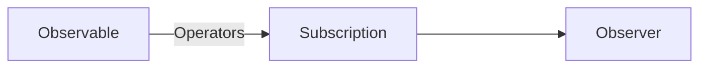
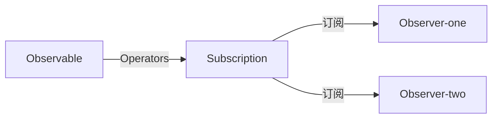

# ReactiveX JavaScript（RxJS）- Day 1

## 什么是 RxJS ？

* 一组可用来处理 **异步** 和 **事件** 的 JavaScript 函数库

## 核心概念：

* **Observable (可观察对象)**： 表示一个概念，这个概念是一个可调用的未来值或事件的集合，简单来说：如果在页面上订阅一个 click 事件，那么这个 click 就是一个可以被观察的事件，然后 click 后发出一系列的事件，然后这整件事是可以被观察的称为 Observable。
* **Observer (观察者)**: 一个回调函数的集合，它知道如何去监听由 Observable 提供的值，简单来说：就是监听Observable异步回调过来的数据。
* **Subscription (订阅)**：表示 Observable 的执行，主要用于取消 Observable 的执行，简单来说：Observer 观察 Observable 的资料，整个过程称之为 Subscription。
* **Operators (操作符)**：采用函数式编程风格的纯函数  (Pure Function)，使用像 map 、filter 、concat 、flatMap 等这样的操作符来处理集合。简单来说：就是 Observable 到 Observer 中间可以过滤资料的运算值。
* **Subject (主体)**：相当于 EventEmitter，并且是将值或事件多路推送给多个 Observer 的唯一方式，简单来说：就是可以获取一个Observable发出的资料，然后分发给对应的Observer，类似于广播的意思。
* **Schedulers (调度器)**: 用来控制并发并且是中央集权的调度员，允许我们在发生计算时进行协调，例如 setTimeout 或 requestAnimationFrame 或其他。

* 产生 **Observable (可观察对象)**，通过 pipe 传入 Operators (操作符)，不止一个；通过 Subscription (订阅) 传入Observer (观察者)

## 为什么要使用 RxJS ？

1. 代码简洁明了。
2. **RxJS** 里提供的很多原生 **JS** 难以实现的功能。
3. **Observable ** 可以发送多个任意类型的值，无论这些值是同步发送的还是异步发送的，接收这些值的 API 都是一样的，由于开始和结束都是由 **Observable** 自己处理的，所以你的应用代码只管订阅并消费这些值就可以了，做完之后，取消订阅。

## 关于 RxJS 我认为还不错的网址

1. RxJS 官网：https://rxjs.dev/
2. RxJS-github：https://github.com/ReactiveX/rxjs （24K Star）
3. RxJS 图解：https://reactive.how/rxjs/
4. RxJS 弹珠图：https://rxmarbles.com/ （rxjs 版本为5.0.3，相对较低）
5. RxJS-Hooks：https://github.com/LeetCode-OpenSource/rxjs-hooks
6. 打通 RxJS 任督二脉系列：https://ithelp.ithome.com.tw/users/20020617/ironman/2959?page=1

写在最后：该内容主要是通过对 **RxJS 任督二脉系列** 的学习，然后写出自己的见解，进行总结。

接下来就开始我的 Rxjs 的学习啦！

